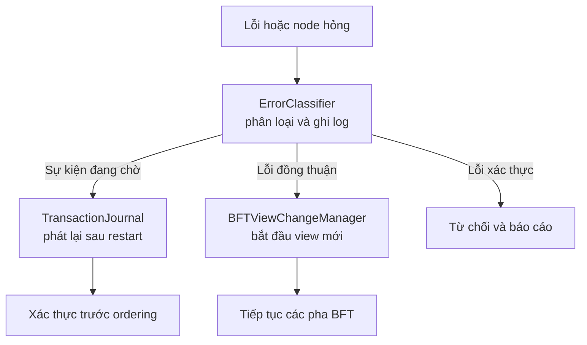

# Xử lý lỗi và phục hồi

HieraChain giữ trách nhiệm phục hồi gần với component sở hữu trạng thái:
`ErrorClassifier` ghi log và phân loại lỗi, `TransactionJournal` bảo vệ các sự
kiện đang chờ, còn implementation BFT xử lý view change khi leader không khả
dụng. Snapshot và phục hồi hạ tầng thuộc về deployment, không phải các service
tự động trong package này.

## Luồng runtime



## Phục hồi đồng thuận

`BFTConsensus` sở hữu việc xử lý leader hỏng thông qua
`BFTViewChangeManager`. Manager phát các message view-change, thu thập quorum
và cài đặt view mới. Luồng này là một phần của consensus runtime và không phụ
thuộc vào recovery engine riêng.

## Độ bền sự kiện

`TransactionJournal` ghi các sự kiện đang chờ trước khi ordering. Sau khi
restart, ordering service có thể phát lại các entry trong journal và xác thực
chúng trước khi đưa trở lại pipeline sự kiện.

```python
from hierachain.error_mitigation.journal import TransactionJournal

journal = TransactionJournal(storage_dir="data/journal")
journal.log_event(event_dict)
```

## Phục hồi vận hành

Backup database, snapshot filesystem, khôi phục khóa và mở rộng hạ tầng phải do
môi trường deployment cung cấp. Repository không tuyên bố có rollback tự động,
khôi phục backup, transport mạng dự phòng hoặc autoscaling node thông qua các
class trong `error_mitigation`.

## Tài liệu liên quan

- [Đồng thuận BFT](./bft-consensus.md): Chi tiết View Change
- [Nạp lại trạng thái chuỗi](./chain-rehydration.md): Tải lại toàn bộ chuỗi từ DB
- [Module Error Mitigation](../modules/error-mitigation.md): Xác thực và journaling
