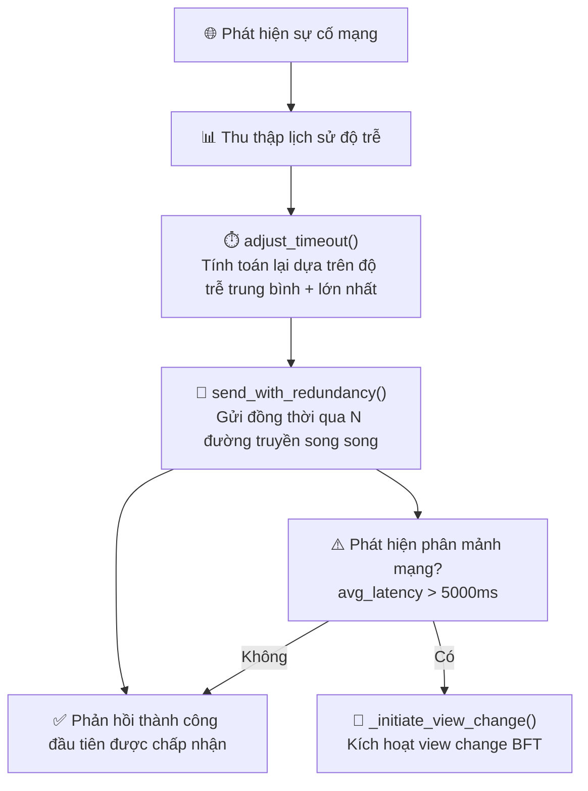
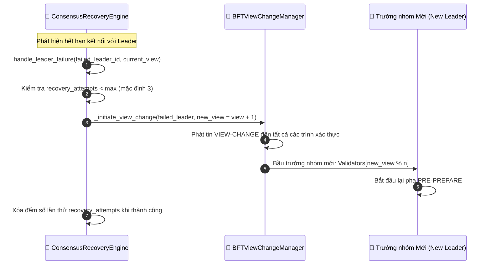
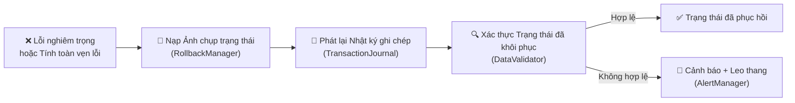

# Giảm thiểu Lỗi & Phục hồi (Error Mitigation & Recovery)

## Tổng quan

HieraChain cung cấp các cơ chế khôi phục tự động phân lớp trên ba khía cạnh: **khả năng phục hồi mạng (network resilience)**, **khôi phục nút trưởng nhóm (consensus leader recovery)**, và **hoàn trả trạng thái (state rollback)**. Các cơ chế này hoạt động độc lập và có thể chạy đồng thời.

---

## 6A — Khôi phục Mạng (Network Recovery)

**Chiến lược**: Phương thức `send_with_redundancy()` gửi cùng một thông điệp qua N đường truyền mạng song song cùng một lúc. Phản hồi thành công đầu tiên sẽ được chấp nhận, và các cuộc gọi đang truyền khác sẽ bị hủy bỏ. Cơ chế này giúp xử lý các lỗi đứt quãng đường truyền mà không cần logic thử lại (retry) phức tạp.

---

## 6B — Khôi phục Đồng thuận (Lỗi Trưởng nhóm - Leader Failure)

---

## 6C — Hoàn trả Trạng thái (State Rollback)

**Các bước hoàn trả**:
1. `RollbackManager.load_snapshot()` — nạp ảnh chụp trạng thái (snapshot) nhất quán gần đây nhất.
2. `TransactionJournal.replay()` — phát lại (replay) các nhật ký đã cam kết kể từ thời điểm chụp snapshot.
3. `DataValidator.validate()` — xác thực trạng thái đã khôi phục so với mã kiểm tra băm (cryptographic checksums).
4. Nếu xác thực thất bại: gửi cảnh báo leo thang qua hệ thống Cảnh báo Rủi ro; yêu cầu sự can thiệp thủ công từ người quản trị.

---

## Các bước thực hiện chi tiết

| Luồng phụ | Kích hoạt | Hành động |
|:----------|:----------|:----------|
| **6A Mạng** | `avg_latency > ngưỡng` | Khoảng thời gian chờ thích ứng + gửi song song dự phòng |
| **6A Phân mảnh** | `avg_latency > 5000ms` | Kích hoạt Thay đổi Phiên (View Change) BFT (Đồng thuận BFT) |
| **6B Trưởng nhóm** | `leader_timeout` | Gọi `ConsensusRecoveryEngine.handle_leader_failure()` $\rightarrow$ View Change |
| **6B Thử lại tối đa**| `recovery_attempts ≥ max` | Ghi lỗi nghiêm trọng, cảnh báo rủi ro, tạm dừng đồng thuận |
| **6C Hoàn trả** | Lỗi toàn vẹn dữ liệu hoặc lỗi nghiêm trọng | Nạp ảnh chụp trạng thái $\rightarrow$ Phát lại Nhật ký $\rightarrow$ Xác thực |

---

## Xử lý lỗi

| Tình huống | Hành vi |
|:-----------|:--------|
| Hết lượt khôi phục (6B) | Gửi cảnh báo rủi ro mức tối cao, nút dừng tham gia quá trình đồng thuận |
| Không tìm thấy Ảnh chụp (6C) | Chuyển sang nạp lại đầy đủ chuỗi từ cơ sở dữ liệu (Chain Rehydration) |
| Phát lại nhật ký ra trạng thái không hợp lệ | Cảnh báo leo thang qua hệ thống Cảnh báo Rủi ro, đánh dấu yêu cầu can thiệp thủ công |
| Sự cố phân mảnh mạng được khắc phục | Khoảng chờ thích ứng tự động giảm xuống, luồng hoạt động bình thường trở lại |

---

## Các Class & Method quan trọng

| Bước | Class / Method | File |
|:-----|:--------------|:-----|
| Cấu hình khoảng chờ mạng | `NetworkRecoveryManager.adjust_timeout()` | `error_mitigation/recovery_engine.py` |
| Gửi tin dự phòng | `send_with_redundancy()` | `error_mitigation/recovery_engine.py` |
| Xử lý lỗi Leader | `ConsensusRecoveryEngine.handle_leader_failure()` | `error_mitigation/recovery_engine.py` |
| Kích hoạt View Change | `BFTViewChangeManager._initiate_view_change()` | `consensus/bft/consensus.py` |
| Nạp ảnh chụp | `RollbackManager.load_snapshot()` | `error_mitigation/rollback_manager.py` |
| Phát lại nhật ký | `TransactionJournal.replay()` | `error_mitigation/journal.py` |
| Xác thực trạng thái | `DataValidator.validate()` | `error_mitigation/validator.py` |

---

## Liên quan

- [Đồng thuận BFT](./bft-consensus.md) — Chi tiết về Thay đổi Phiên (View Change)
- [Khóa băng Cụm](./cluster-lockdown.md) — Khôi phục ở cấp độ toàn cụm nút
- [Nạp lại Trạng thái Chuỗi](./chain-rehydration.md) — Tải lại toàn bộ chuỗi từ cơ sở dữ liệu (DB)
- [Cảnh báo Rủi ro](./risk-alerts.md) — Các thông báo cảnh báo leo thang
