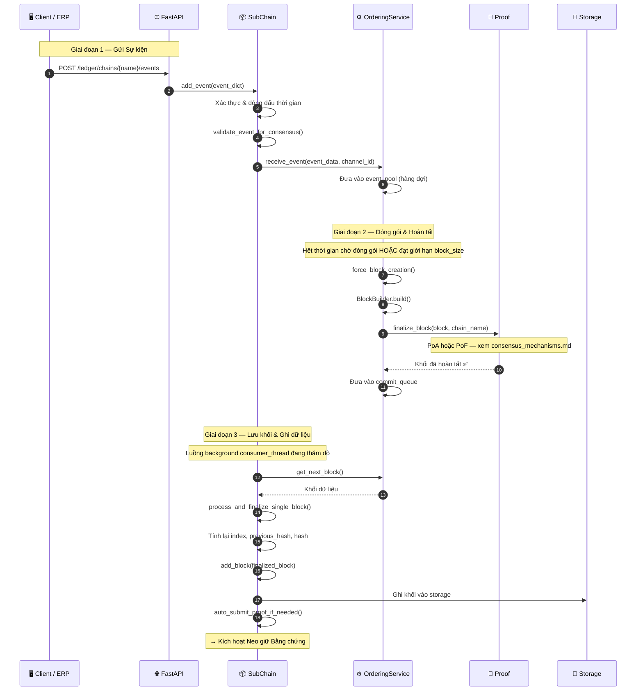

# Gửi Sự kiện (Event Submission)

## Tổng quan

Các sự kiện đi vào HieraChain dưới dạng các hoạt động nghiệp vụ có cấu trúc, được xác thực, gom nhóm theo lô bởi `OrderingService` thành các khối, được hoàn thiện bằng cơ chế **Bằng chứng (Proof)** được cấu hình (PoA / PoF / BFT), sau đó được thêm vào Sub-Chain. Cơ chế đồng thuận cho MainChain có thể cấu hình linh hoạt (`HRC_MAINCHAIN_CONSENSUS`), trong khi SubChain mặc định sử dụng PoA cho các hoạt động nội bộ tốc độ cao. Quy trình tổng thể luôn giống nhau — chỉ khác biệt ở bước `finalize_block()`.

Để xem biểu đồ chi tiết của PoA và PoF, vui lòng tham khảo [Cơ chế Đồng thuận](./consensus_mechanisms.md).

---

## Biểu đồ luồng



---

## Các bước thực hiện chi tiết

| Bước | Mô tả |
|:-----|:------|
| **1. Nhận sự kiện qua API** | FastAPI xác thực cấu trúc yêu cầu, trích xuất dữ liệu `event_dict`. |
| **2. Xác thực Chuỗi con (SC)** | `SubChain.add_event()` đóng dấu `timestamp`, gọi `validate_event_for_consensus()` — quét các từ khóa cấm về cryptocurrency. |
| **3. Đưa vào hàng đợi Sắp xếp (OS)** | Sự kiện được đẩy vào `event_pool` (hàng đợi trong bộ nhớ). `OrderingService` gom cụm các sự kiện theo bộ hẹn giờ hoặc theo ngưỡng `block_size`. |
| **4. Xây dựng Khối** | `BlockBuilder.build()` lắp ráp khối bao gồm: chỉ số (index), băm khối trước đó (previous_hash), mã băm Merkle root của các sự kiện, dữ liệu đặc tả (metadata). |
| **5. Hoàn tất** | `Proof.finalize_block()` — PoA ký bằng Ed25519, PoF xác thực luân chuyển leader + bằng chứng ZK, BFT chạy quy trình 3 pha PBFT. |
| **6. Ghi khối (Commit)** | Khối được đẩy vào `commit_queue`, luồng nền `consumer_thread` sẽ tiếp nhận để xử lý. |
| **7. Liên kết chuỗi băm** | Lệnh `_process_and_finalize_single_block()` tính toán lại `previous_hash` và `hash` để đảm bảo tính toàn vẹn của chuỗi. |
| **8. Lưu trữ** | Khối được ghi vào bộ lưu trữ backend thông qua (`SQLiteAdapter`, `RedisStorageAdapter`, hoặc `MemoryStorage`). |
| **9. Kích hoạt Bằng chứng** | Lệnh `auto_submit_proof_if_needed()` kích hoạt Neo giữ Bằng chứng nếu đạt ngưỡng chiều dài chuỗi tối thiểu. |

---

## Cấu trúc Sự kiện (Event)

```python
event = {
    "entity_id": "product-SKU-001",    # Định danh thực thể nghiệp vụ (Domain entity)
    "event": "quality_check",           # Loại sự kiện (domain-specific)
    "timestamp": 1714000000.0,
    "details": {                        # Dữ liệu nghiệp vụ chi tiết
        "check_type": "visual",
        "check_result": "passed",
        "inspector": "station-7"
    }
}
```

> **Quan trọng**: Tuyệt đối không được sử dụng các thuật ngữ cryptocurrency (`transaction`, `sender`, `receiver`, `amount`, `wallet`, `fee`). Bộ quét `validate_event_for_consensus()` sẽ từ chối sự kiện ngay lập tức.

---

## Xử lý lỗi

| Tình huống | Hành vi |
|:-----------|:--------|
| Phát hiện từ khóa cryptocurrency bị cấm | Ném lỗi `ValueError`, từ chối sự kiện trước khi xếp hàng đợi |
| Hoàn tất khối thất bại (PoA: quyền không hợp lệ) | Hủy bỏ khối, ghi nhật ký lỗi, đưa sự kiện lại vào hàng đợi |
| Hoàn tất khối thất bại (PoF: sai leader) | Từ chối khối, lệnh `validate_block_proposer()` ném ra lỗi |
| Lưu trữ thất bại | Rollback session `SQLAlchemy`; khối vẫn nằm trong commit_queue để thử lại |
| Lỗi luồng Consumer | Bắt lỗi ngoại lệ ở cấp độ luồng, ghi nhật ký và khởi động lại luồng nền |

---

## Các Class & Method quan trọng

| Bước | Class / Method | File |
|:-----|:--------------|:-----|
| Nhận sự kiện | `SubChain.add_event()` | `hierarchical/sub_chain.py` |
| Quét từ khóa cấm | `BaseConsensus.validate_event_for_consensus()` | `consensus/base_consensus.py` |
| Đóng gói & sắp xếp | `OrderingService.receive_event()` | `consensus/ordering/service.py` |
| Xây dựng khối | `BlockBuilder.build()` | `consensus/ordering/block_builder.py` |
| Hoàn tất PoA | `ProofOfAuthority.finalize_block()` | `consensus/proof_of_authority.py` |
| Hoàn tất PoF | `ProofOfFederation.finalize_block()` | `consensus/proof_of_federation.py` |
| Liên kết & Thêm khối | `SubChain._process_and_finalize_single_block()` | `hierarchical/sub_chain.py` |
| Ghi dữ liệu | `SQLiteAdapter` / `RedisStorageAdapter` | `adapters/storage/` |

---

## Liên quan

- [Cơ chế Đồng thuận](./consensus_mechanisms.md) — Sơ đồ luồng phụ của PoA và PoF
- [Neo giữ Bằng chứng](./proof-anchoring.md) — Kích hoạt sau khi khối được hoàn tất
- [Đồng thuận BFT](./bft-consensus.md) — Luồng PBFT 3 pha đầy đủ
- [Thực thi Chính sách](./policy-enforcement.md) — Kiểm soát quyền truy cập trước khi gọi `add_event()`
- [Định danh & Ủy quyền MSP](./msp-identity.md) — Gọi `authorize_action()` trước khi gửi sự kiện
