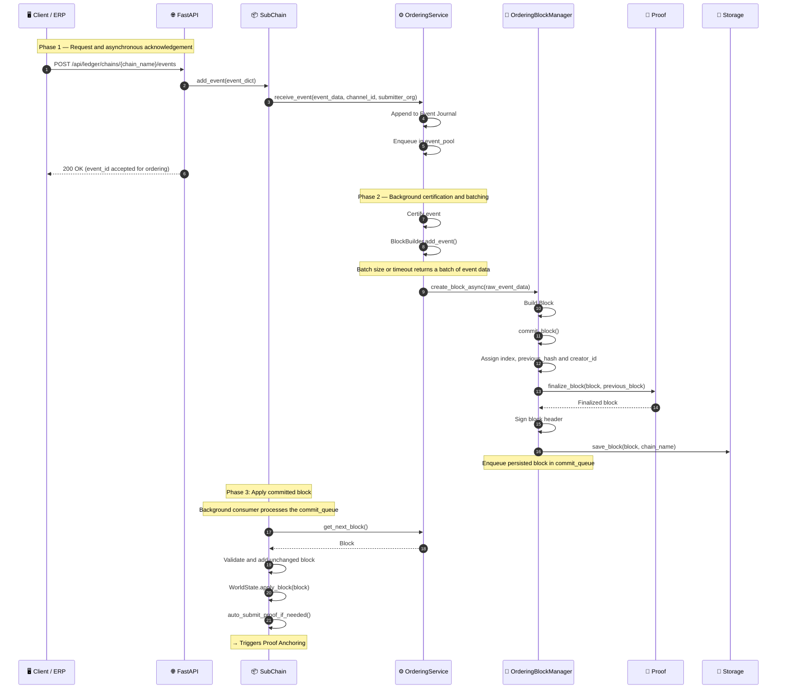

# Gửi sự kiện

## Tổng quan

Ledger API xác thực từng yêu cầu sự kiện. Sau đó, `SubChain.add_event()` gửi sự kiện đến `OrderingService`, dịch vụ ghi nhật ký và xếp hàng trước khi trả về `event_id`. ID xác nhận đã tiếp nhận để sắp thứ tự; việc ghi khối diễn ra sau đó. Bộ xử lý nền chứng nhận và gom sự kiện thành lô. Orderer dựng từng khối, gán chỉ số và hash khối trước, chạy bước hoàn tất đồng thuận đã cấu hình, ký header và lưu khối bền vững trước khi đưa vào hàng đợi commit. Consumer của Sub-Chain áp dụng nguyên trạng khối đó vào chuỗi cục bộ và WorldState. Mặc định, Sub-Chain gom lô 50 sự kiện và chờ 1.0 giây trước khi tạo khối. Cấu hình đồng thuận Main-Chain riêng bằng `HRC_MAINCHAIN_CONSENSUS`.

Với sơ đồ PoA và PoF, xem [Cơ chế Đồng thuận](./consensus_mechanisms.md).

## Biểu đồ luồng


```mermaid
sequenceDiagram
    autonumber
    participant Client as 🖥️ Client / ERP
    participant API as 🌐 FastAPI
    participant SC as 📦 SubChain
    participant OS as ⚙️ OrderingService
    participant BM as 🧱 OrderingBlockManager
    participant PRF as 🔐 Proof
    participant DB as 💾 Storage

    rect rgb(0, 0, 0, 0)
        Note over Client,API: Phase 1 — Request and asynchronous acknowledgement
        Client->>API: POST /api/ledger/chains/{chain_name}/events
        API->>SC: add_event(event_dict)
        SC->>OS: receive_event(event_data, channel_id, submitter_org)
        OS->>OS: Append to Event Journal
        OS->>OS: Enqueue in event_pool
        API-->>Client: 200 OK (event_id accepted for ordering)
    end

    rect rgb(0, 0, 0, 0)
        Note over OS: Phase 2 — Background certification and batching
        OS->>OS: Certify event
        OS->>OS: BlockBuilder.add_event()
        Note over OS: Batch size or timeout returns a batch of event data
        OS->>BM: create_block_async(raw_event_data)
        BM->>BM: Build Block
        BM->>BM: commit_block()
        BM->>BM: Assign index, previous_hash and creator_id
        BM->>PRF: finalize_block(block, previous_block)
        PRF-->>BM: Finalized block
        BM->>BM: Sign block header
        BM->>DB: save_block(block, chain_name)
        Note over BM: Enqueue persisted block in commit_queue
    end

    rect rgb(0, 0, 0, 0)
        Note over SC: Phase 3: Apply committed block
        Note over SC: Background consumer processes the commit_queue

        SC->>OS: get_next_block()
        OS-->>SC: Block
        SC->>SC: Validate and add unchanged block
        SC->>SC: WorldState.apply_block(block)
        SC->>SC: auto_submit_proof_if_needed()

        Note over SC: → Triggers Proof Anchoring
    end
```

## Các bước chi tiết

| Bước | Mô tả |
|:-----|:------------|
| 1. API tiếp nhận | `POST /api/ledger/chains/{chain_name}/events` xác thực lược đồ yêu cầu và chuyển sự kiện đến Sub-Chain |
| 2. Xếp hàng | `SubChain.add_event()` bổ sung giá trị mặc định nội bộ còn thiếu và xác thực cấu trúc sự kiện trước khi gọi `OrderingService.receive_event()`; orderer ghi nhật ký trước khi xếp hàng và trả về `event_id` |
| 3. Chứng thực nền | Ordering Service chuyển sự kiện qua certifier sau phản hồi API; sự kiện bị từ chối không được đưa vào block. |
| 4. Gom lô | `BlockBuilder.add_event()` thêm sự kiện đã chứng nhận vào lô; ngưỡng kích thước, thời gian chờ hoặc lệnh flush trả về dữ liệu lô |
| 5. Dựng khối | `OrderingBlockManager.create_block_async()` dựng một `Block` |
| 6. Hoàn tất và lưu | `commit_block()` gán chỉ số/liên kết/bên tạo khối, gọi bước hoàn tất đồng thuận, ký header và lưu khối trước khi xếp hàng |
| 7. Áp dụng | Consumer xác thực và thêm nguyên trạng khối, rồi cập nhật WorldState; nó không lưu khối lần nữa |
| 8. Kích hoạt proof | `auto_submit_proof_if_needed()` có thể gửi proof lên Main Chain khi đạt ngưỡng đã cấu hình. |

## Cấu trúc sự kiện

```python
event = {
    "entity_id": "product-SKU-001",    # Domain entity identifier
    "event_type": "quality_check",      # Event type (domain-specific)
    "timestamp": 1714000000.0,
    "details": {                        # Domain-specific payload
        "check_type": "visual",
        "check_result": "passed",
        "inspector": "station-7"
    }
}
```

> Ledger API yêu cầu `entity_id` và `event_type`, đồng thời ánh xạ `event_type` sang trường nội bộ `event`. Giá trị mặc định trong `SubChain.add_event()` áp dụng cho lời gọi nội bộ, không khiến các trường API này trở thành tùy chọn. `SubChain.add_event()` từ chối sự kiện sai định dạng và thuật ngữ bị cấm trước khi xếp hàng. `event_id` trả về xác nhận đã tiếp nhận để sắp thứ tự, không xác nhận khối đã hoàn tất.

## Xử lý lỗi

| Tình huống | Hành vi |
|:----------|:---------|
| Body yêu cầu không hợp lệ | FastAPI từ chối trong bước xác thực mô hình yêu cầu trước khi gọi `SubChain.add_event()` |
| Cấu trúc event không hợp lệ | `SubChain.add_event()` ném `ValueError` trước khi ghi journal; API Ledger trả HTTP 422. |
| Ghi nhật ký thất bại | `OrderingService.receive_event()` phát sinh lỗi trước khi thêm sự kiện vào hàng đợi trong bộ nhớ |
| Chứng thực event thất bại | Processor đánh dấu event bị từ chối; event không được thêm vào block. |
| Lưu block Ordering thất bại | Lỗi được ghi log và Ordering Service chuyển sang `MAINTENANCE`; block chưa được đưa vào `commit_queue`. |
| Hoàn tất đồng thuận hoặc ký thất bại | Orderer chuyển sang `MAINTENANCE` trừ khi đã ở trạng thái kết thúc/hạn chế; khối không được đưa vào hàng đợi commit |
| Consumer từ chối khối đã commit | Khi `add_block()` thất bại, orderer chuyển sang `MAINTENANCE`, đặt `should_stop` và ghi log khối bị từ chối |

## Lớp và phương thức chính

| Bước | Lớp / Phương thức | Tệp |
|:-----|:--------------|:-----|
| Tiếp nhận sự kiện | `SubChain.add_event()` | `hierachain/hierarchical/sub_chain/base.py` |
| Journal và xếp hàng | `OrderingService.receive_event()` | `hierachain/consensus/ordering/service.py` |
| Chứng thực và gom batch | `OrderingProcessor`; `BlockBuilder.add_event()` | `hierachain/consensus/ordering/processor.py`; `hierachain/consensus/ordering/block_builder.py` |
| Tạo và commit block Ordering | `OrderingBlockManager.create_block_async()`; `commit_block()` | `hierachain/consensus/ordering/block_manager.py` |
| Áp dụng khối Sub-Chain đã lưu | `_process_and_finalize_single_block()` | `hierachain/hierarchical/sub_chain/block.py` |
| Storage adapter | Database adapters | `hierachain/adapters/database/` |

## Liên quan

- [Cơ chế Đồng thuận](./consensus_mechanisms.md): sơ đồ phụ PoA và PoF
- [Neo giữ Bằng chứng](./proof-anchoring.md): kích hoạt sau khi khối hoàn tất
- [Đồng thuận BFT](./bft-consensus.md): luồng PBFT 3 pha đầy đủ
- [Thực thi chính sách](./policy-enforcement.md): kiểm tra chính sách cho các thao tác được chuyển rõ ràng qua `PolicyEngine`
- [Danh tính MSP](./msp-identity.md): kiểm tra thành viên cho bên gọi sử dụng `HierarchicalMSP`
