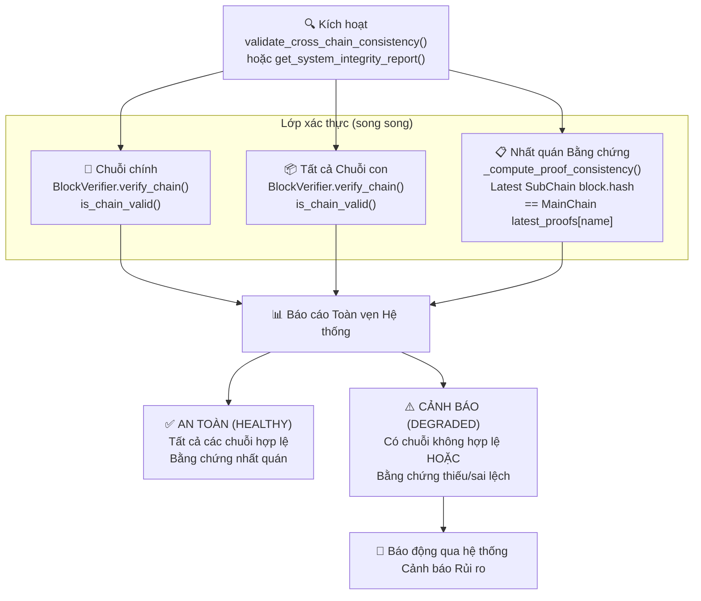
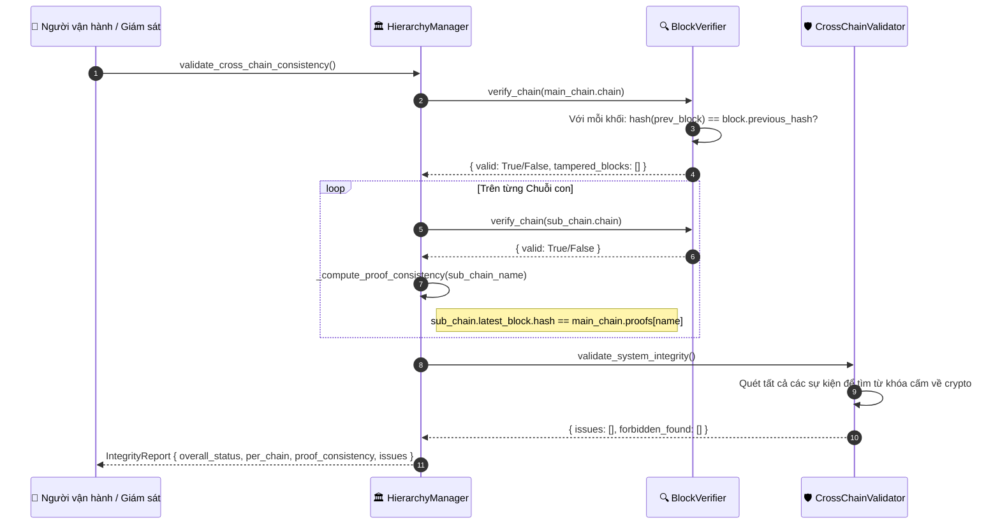

# Xác thực Tính toàn vẹn Hệ thống (System Integrity Validation)

## Tổng quan

Quy trình xác thực tính toàn vẹn trên toàn hệ thống kiểm tra **tính nhất quán mã hóa (cryptographic consistency)** của tất cả các chuỗi và xác minh rằng các bằng chứng được lưu trữ trên Chuỗi chính (Main Chain) khớp hoàn toàn với các khối mới nhất trên từng Chuỗi con (Sub-Chain). Đây là cơ chế chính để **phát hiện can thiệp trái phép (tamper detection)** và **tuân thủ quy trình kiểm toán (audit compliance)**.

Quy trình xác thực chạy ba lớp kiểm tra song song: tính hợp lệ mã hóa của Chuỗi chính, tính hợp lệ mã hóa của Chuỗi con, và tính nhất quán của bằng chứng giữa hai cấp chuỗi.

---

## Biểu đồ luồng



---

## Luồng Phát hiện Can thiệp Trái phép



---

## Cấu trúc Báo cáo Toàn vẹn (Integrity Report)

```python
{
    "timestamp": 1714000000.0,
    "overall_status": "HEALTHY",          # hoặc "DEGRADED"
    "system_overview": {
        "total_sub_chains": 3,
        "total_sub_chain_blocks": 142,
        "total_sub_chain_events": 3580,
        "system_uptime": 86400.0
    },
    "main_chain": {
        "valid": True,
        "height": 47
    },
    "sub_chains": {
        "supply_chain": {"valid": True, "height": 61},
        "logistics":    {"valid": True, "height": 48},
        "finance":      {"valid": True, "height": 33}
    },
    "proof_consistency": {
        "supply_chain": {
            "consistent": True,
            "latest_proof_hash": "a3f8b2...",
            "chain_height": 61
        }
    },
    "issues": []
}
```

---

## Các bước thực hiện chi tiết

| Bước | Mô tả |
|:-----|:------|
| **1. Kích hoạt** | Hẹn giờ định kỳ, lệnh gọi từ người vận hành, hoặc phát hiện bất thường từ hệ thống Cảnh báo Rủi ro. |
| **2. Xác thực Chuỗi chính** | Lệnh `BlockVerifier.verify_chain()` tính toán lại mã băm của mọi khối và kiểm tra các liên kết `previous_hash`. |
| **3. Xác thực Chuỗi con** | Thực hiện quy trình xác thực tương tự song song trên tất cả các Chuỗi con đã đăng ký. |
| **4. Nhất quán bằng chứng** | So sánh giá trị `sub_chain.latest_block.hash` với bằng chứng được lưu trên Chuỗi chính `main_chain.proofs[chain_name]`. |
| **5. Quét từ khóa cấm** | Lệnh `CrossChainValidator` quét toàn bộ payload sự kiện để phát hiện các thuật ngữ liên quan đến cryptocurrency. |
| **6. Tổng hợp báo cáo** | Ghép tất cả các kết quả phân tích thành một thực thể `IntegrityReport` duy nhất. |
| **7. Cảnh báo khi DEGRADED** | Nếu có bất kỳ bước kiểm tra nào thất bại, hệ thống Cảnh báo Rủi ro sẽ gửi thông báo chi tiết lỗi ngay lập tức. |

---

## Xử lý lỗi

| Tình huống | Trạng thái | Hành động |
|:-----------|:-----------|:----------|
| Lệch mã băm trên Chuỗi chính | `DEGRADED` | Đánh dấu chỉ số khối bị can thiệp; phát cảnh báo khẩn cấp |
| Chuỗi con bị thiếu bằng chứng | `DEGRADED` | Ghi nhật ký thiếu bằng chứng; gửi cảnh báo |
| Mã băm của Chuỗi con khác với bằng chứng trên Chuỗi chính | `DEGRADED` | Phát hiện can thiệp dữ liệu trái phép; phát cảnh báo tối cao |
| Tìm thấy từ khóa crypto cấm trong sự kiện | `DEGRADED` | Đánh dấu sự kiện, ghi nhật ký kèm đường dẫn chi tiết |

---

## Các Class & Method quan trọng

| Bước | Class / Method | File |
|:-----|:--------------|:-----|
| Báo cáo toàn phần | `HierarchyManager.get_system_integrity_report()` | `hierarchical/hierarchy_manager.py` |
| Kiểm tra nhất quán | `HierarchyManager.validate_cross_chain_consistency()` | `hierarchical/hierarchy_manager.py` |
| Xác thực chuỗi | `BlockVerifier.verify_chain()` | `security/verify/block_verifier.py` |
| Xác thực đơn khối | `BlockVerifier.verify_block()` | `security/verify/block_verifier.py` |
| Quét từ khóa cấm | `CrossChainValidator.validate_system_integrity()` | `domains/generic/utils/cross_chain_validator.py` |
| REST API | `GET /ledger/system/integrity` | `api/ledger/routes.py` |

---

## Liên quan

- [Neo giữ Bằng chứng](./proof-anchoring.md): Tạo ra các bằng chứng được kiểm tra tại đây
- [Nạp lại Trạng thái Chuỗi](./chain-rehydration.md): Được gọi nếu phát hiện không nhất quán và cần nạp lại chuỗi từ DB
- [Cảnh báo Rủi ro](./risk-alerts.md): Tiếp nhận các thông tin cảnh báo DEGRADED từ quy trình này
