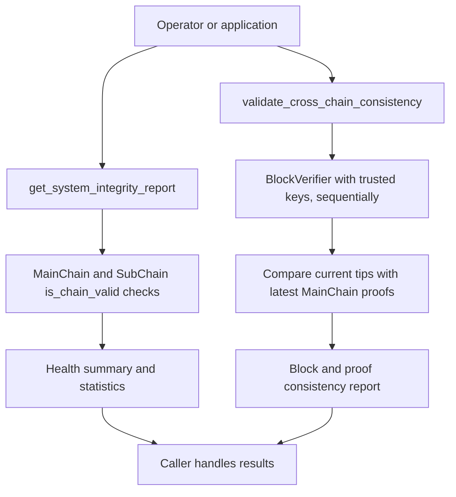

# Xác thực tính toàn vẹn hệ thống

## Tổng quan

`HierarchyManager` cung cấp hai phương thức Python với kết quả khác nhau. `get_system_integrity_report()` tổng hợp tính hợp lệ của chuỗi và thống kê hệ thống. `validate_cross_chain_consistency()` xác minh khối bằng khóa ký tin cậy và so sánh khối cuối của từng Sub-Chain với bằng chứng MainChain mới nhất của nó.

Cả hai phương thức kiểm tra tuần tự các chuỗi đã đăng ký. Bên gọi quyết định thời điểm chạy và cách xử lý thất bại. Không phương thức nào gọi `CrossChainValidator`, lên lịch khôi phục hay gửi cảnh báo rủi ro. API không có endpoint `/api/ledger/system/integrity`.

## Biểu đồ luồng


```mermaid
flowchart TD
    Caller[Operator or application] --> Health[get_system_integrity_report]
    Health --> Validity[MainChain and SubChain is_chain_valid checks]
    Validity --> Summary[Health summary and statistics]
    Caller --> Consistency[validate_cross_chain_consistency]
    Consistency --> Verify[BlockVerifier with trusted keys, sequentially]
    Verify --> Proofs[Compare current tips with latest MainChain proofs]
    Proofs --> Report[Block and proof consistency report]
    Summary --> Handle[Caller handles results]
    Report --> Handle
```

## Báo cáo sức khỏe

`get_system_integrity_report()` trả về:

| Trường | Ý nghĩa |
|:------|:--------|
| `timestamp` | Thời điểm báo cáo |
| `overall_status`, `integrity_status` | `HEALTHY` hoặc `DEGRADED` dựa trên tính hợp lệ của chuỗi |
| `system_overview` | Tổng số Sub-Chain và thời gian hoạt động hệ thống |
| `main_chain` | Tính hợp lệ và chiều cao MainChain |
| `sub_chains` | Tính hợp lệ và chiều cao của từng chuỗi |
| `sub_chain_details` | Loại miền, khối, sự kiện, thực thể, thao tác và tính hợp lệ |
| `issues` | Mô tả lỗi xác thực chuỗi |

Kết quả này không có trường `proof_consistency`. Báo cáo chuỗi khỏe mạnh không chứng minh mọi khối cuối Sub-Chain hiện tại đều có neo MainChain tương ứng.

## Báo cáo nhất quán liên chuỗi

`validate_cross_chain_consistency()` trả về `timestamp`, `main_chain_valid`, `overall_consistent`, `sub_chain_validation`, `block_verification` và `proof_consistency`. Việc xác minh khối dùng `BlockVerifier.verify_chain(chain.chain, chain.trusted_public_keys)` cho MainChain và từng Sub-Chain đã đăng ký.

Mỗi kết quả bằng chứng chứa `consistent`, `pending`, `reason`, `chain_height` và `last_block_index`. Khi có bằng chứng, kết quả còn có `latest_proof_hash`, `latest_block_hash` và `latest_proof_block_index`. Nhất quán nghĩa là hash bằng chứng đã lưu bằng hash khối cuối Sub-Chain hiện tại.

`pending=True` giải thích trường hợp neo bị thiếu hoặc cũ khi chưa đến lần gửi tiếp theo theo lịch bằng chứng của chuỗi. Nó vẫn đặt `consistent=False` và khiến `overall_consistent=False`. Bản thân độ trễ theo lịch không phải bằng chứng dữ liệu bị sửa trái phép.

```python
# manager is the application's configured HierarchyManager.
health = manager.get_system_integrity_report()
consistency = manager.validate_cross_chain_consistency()

for chain_name, proof in consistency["proof_consistency"].items():
    if not proof["consistent"]:
        print(chain_name, proof["pending"], proof["reason"])
```

## Trách nhiệm của bên gọi

Chạy kiểm tra thuật ngữ miền riêng qua `CrossChainValidator` nếu ứng dụng cần. Chủ động kết nối việc xử lý báo cáo với `AlertManager` hoặc quy trình khôi phục vận hành. Không có hook tích hợp sẵn từ báo cáo sang cảnh báo hoặc dựng lại chuỗi.

## Lớp và phương thức chính

| Thao tác | Phương thức | Tệp |
|:----------|:-------|:-----|
| Phương thức công khai | `HierarchyManager.get_system_integrity_report()` / `validate_cross_chain_consistency()` | `hierachain/hierarchical/hierarchy_manager/base.py` |
| Triển khai báo cáo | `_compute_system_integrity_report()` | `hierachain/hierarchical/hierarchy_manager/validation.py` |
| Triển khai kiểm tra nhất quán | `_validate_cross_chain_consistency()` | `hierachain/hierarchical/hierarchy_manager/validation.py` |
| Xác minh chữ ký/hash | `BlockVerifier.verify_chain()` | `hierachain/security/verify/block_verifier.py` |
| Kiểm tra miền riêng | `CrossChainValidator.validate_system_integrity()` | `hierachain/domains/utils/cross_chain_validator.py` |

## Liên quan

- [Neo bằng chứng](./proof-anchoring.md): tạo các neo đã lưu
- [Khôi phục chuỗi](./chain-rehydration.md): đồng bộ chuỗi theo lời gọi rõ ràng
- [Phân tích rủi ro và cảnh báo](./risk-alerts.md): gửi cảnh báo do bên gọi quản lý
