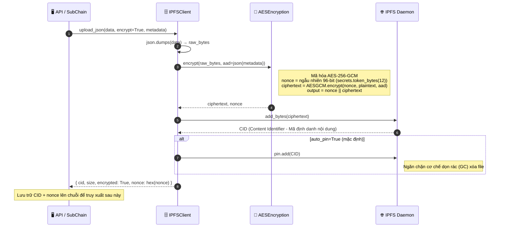
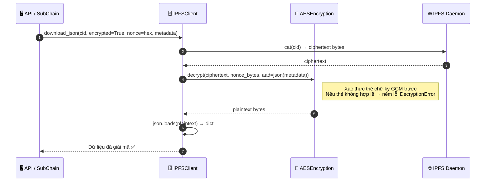
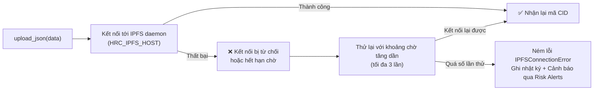

# Lưu trữ Mã hóa IPFS (IPFS Encrypted Storage)

## Tổng quan

Các dữ liệu lớn hoặc nhạy cảm nằm ngoài chuỗi (ví dụ: tài liệu đính kèm, bằng chứng kiểm toán, tài sản nhị phân) được lưu trữ trên một mạng riêng tư IPFS swarm với **cơ chế mã hóa bắt buộc AES-256-GCM**. Chỉ có các nút chia sẻ chung khóa mật mã mới có quyền giải mã dữ liệu này. Mã định danh nội dung (CID) do IPFS trả về được lưu trữ trên chuỗi làm tham chiếu trỏ tới; dữ liệu dạng văn bản thô (plaintext) không bao giờ rời khỏi ranh giới mã hóa.

**Đặc tính an toàn cốt lõi**: Ngay cả khi bộ lưu trữ IPFS bị tấn công vật lý, dữ liệu vẫn hoàn toàn không thể đọc được nếu không có khóa giải mã AES-256-GCM.

---

## Biểu đồ luồng — Tải lên (Mã hóa → Lưu trữ → Ghim)

---

## Biểu đồ luồng — Tải về (Truy xuất → Giải mã)

---

## Xử lý lỗi — IPFS Ngoại tuyến

---

## Các bước thực hiện chi tiết

| Bước | Mô tả |
|:-----|:------|
| **1. Tuần tự hóa** | Thực hiện `json.dumps(data)` chuyển đổi thành mảng bytes thô. |
| **2. Mã hóa** | Sử dụng thuật toán AES-256-GCM với nonce ngẫu nhiên 96-bit. Dữ liệu xác thực bổ sung AAD (Additional Authenticated Data) được xây dựng từ metadata dạng JSON. |
| **3. Tải lên** | Mảng bytes dữ liệu đã mã hóa (ciphertext) được truyền tới IPFS daemon thông qua Kubo RPC API (`httpx`). |
| **4. Ghim dữ liệu** | Lệnh `pin.add(CID)` giữ dữ liệu an toàn trên đĩa cứng, ngăn không cho tiến trình dọn rác của IPFS tự động xóa bỏ. |
| **5. Trả kết quả** | Bên gọi nhận về thông tin `{ cid, nonce }` — cả hai tham số này phải được lưu trữ trên chuỗi phục vụ truy xuất sau này. |
| **6. Truy xuất** | Phương thức `cat(cid)` tải về mảng bytes mã hóa; lệnh `decrypt()` kiểm tra thẻ xác thực GCM trước khi giải mã dữ liệu thô. |

---

## Các thuộc tính an ninh mạng

| Thuộc tính | Cơ chế |
|:-----------|:-------|
| **Tính bảo mật** | Mã hóa cấp độ doanh nghiệp AES-256-GCM |
| **Tính toàn vẹn** | Xác thực bằng thẻ chữ ký GCM (authenticated encryption) |
| **Chống phát lại** | Mỗi lần tải lên sử dụng một mã nonce ngẫu nhiên 96-bit độc nhất |
| **Quản lý khóa** | Cấu hình qua biến môi trường `HRC_IPFS_ENCRYPTION_KEY`; tự động sinh nếu thiếu |
| **Kiểm soát quyền** | Bộ máy chính sách (Thực thi Chính sách) kiểm soát quyền gọi các API upload/download |

---

## Các Class & Method quan trọng

| Bước | Class / Method | File |
|:-----|:--------------|:-----|
| Điểm tải lên | `IPFSClient.upload_json()` | `api/storage/ipfs_client.py` |
| Mã hóa dữ liệu | `AESEncryption.encrypt()` | `api/storage/encryption.py` |
| Tải bytes thô | `IPFSClient.upload_bytes()` | `api/storage/ipfs_client.py` |
| Ghim dữ liệu | `IPFSClient.pin()` | `api/storage/ipfs_client.py` |
| Tải về & Giải mã | `IPFSClient.download_json()` | `api/storage/ipfs_client.py` |
| Bộ tạo Client | `create_ipfs_client_from_env()` | `api/storage/ipfs_client.py` |

---

## Liên quan

- [Thực thi Chính sách](./policy-enforcement.md) — Kiểm soát quyền truy cập của việc tải lên/tải xuống dữ liệu
- [Cảnh báo Rủi ro](./risk-alerts.md) — Lỗi kết nối IPFS sẽ kích hoạt hệ thống gửi cảnh báo
- [Sao lưu & Khôi phục Khóa](./key-backup.md) — Áp dụng chung mô hình mã hóa AES-256-GCM cho việc lưu trữ các bản sao lưu khóa
