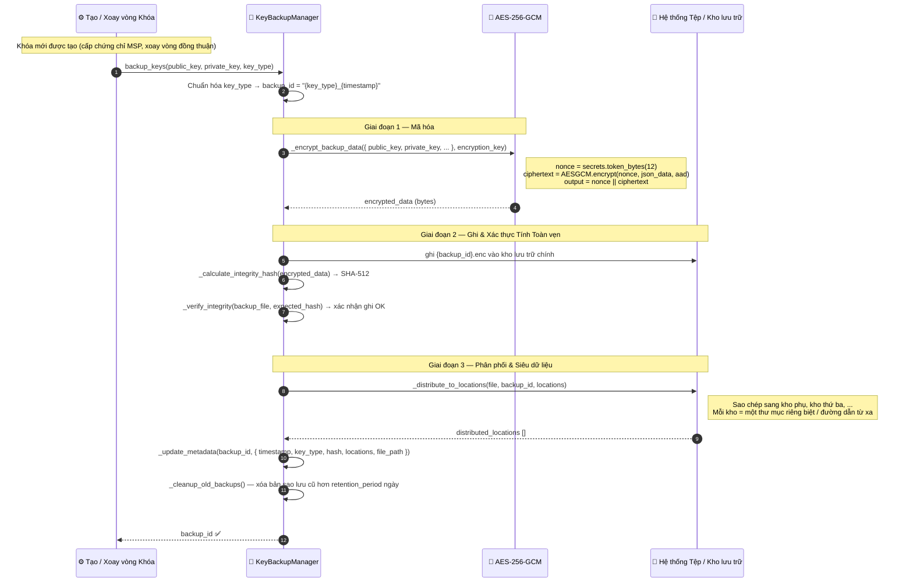
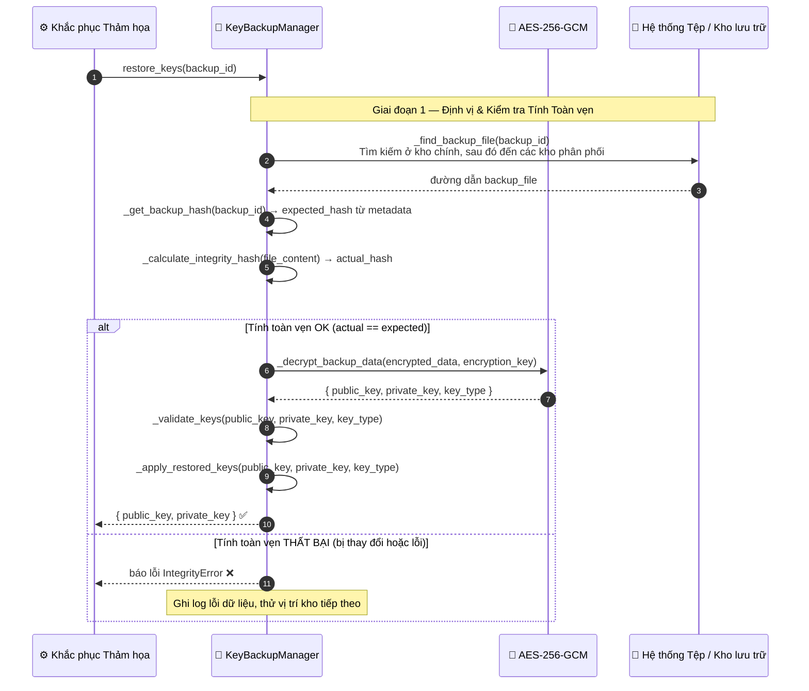
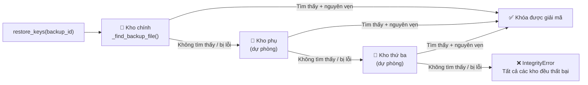

# Sao lưu & Khôi phục Khóa

## Tổng quan

Các khóa mật mã (khóa đồng thuận, khóa danh tính, khóa mã hóa) được sao lưu tự động sau mỗi sự kiện tạo mới hoặc xoay vòng khóa. Mỗi bản sao lưu được **mã hóa bằng AES-256-GCM** và được phân phối đến nhiều vị trí kho lưu trữ (vault). Khi khôi phục, `restore_keys()` sẽ xác thực **tính toàn vẹn bằng SHA-512** trước khi giải mã và áp dụng các khóa vào hệ thống.

**Đặc tính quan trọng**: Ngay cả khi một kho lưu trữ bị xâm nhập, các khóa văn bản thô (plaintext keys) vẫn được bảo vệ bằng AES-256-GCM. Ngay cả khi bản mã (ciphertext) bị thay đổi, việc kiểm tra tính toàn vẹn SHA-512 sẽ ngăn chặn giải mã dữ liệu bị hỏng.

---

## Sơ đồ Luồng — Sao lưu

---

## Sơ đồ Luồng — Khôi phục

---

## Cơ chế Dự phòng Đa Kho (Multi-Vault Failover)

---

## Chi tiết Từng Bước

| Bước | Mô tả |
|:-----|:------------|
| **1. Kích hoạt** | Khóa được tạo (cấp chứng chỉ MSP) hoặc xoay vòng (theo lịch trình) |
| **2. ID Sao lưu** | `backup_id = "{sanitized_key_type}_{unix_timestamp}"` |
| **3. Mã hóa** | AES-256-GCM với nonce 96-bit ngẫu nhiên. Kết quả = `nonce \|\| ciphertext` |
| **4. Ghi + xác thực** | Ghi vào kho chính; mã băm SHA-512 của tệp được xác minh ngay lập tức |
| **5. Phân phối** | Sao chép đến tất cả các kho lưu trữ được cấu hình |
| **6. Siêu dữ liệu** | Cập nhật `metadata.json`: backup_id, key_type, hash, locations, timestamp |
| **7. Dọn dẹp** | Xóa các bản sao lưu cũ hơn `retention_period` (mặc định là 365 ngày) |
| **8. Khôi phục** | Tìm tệp $\rightarrow$ xác thực SHA-512 $\rightarrow$ giải mã $\rightarrow$ xác thực cặp khóa $\rightarrow$ áp dụng |

---

## Cấu hình Sao lưu

| Tham số | Mặc định | Mô tả |
|:----------|:--------|:------------|
| `frequency` | `daily` | Lịch trình sao lưu |
| `encryption_algorithm` | `AES-256-GCM` | Thuật toán mã hóa |
| `integrity_check` | `sha512` | Thuật toán băm để xác thực tính toàn vẹn khi ghi |
| `retention_period` | `365` ngày | Thời gian giữ lại trước khi tự động dọn dẹp |
| `locations` | `[primary_vault]` | Mục tiêu phân phối sao lưu |
| `auto_restore_threshold` | `1` | Số bản sao tối thiểu trước khi tự động kích hoạt khôi phục |

---

## Xử lý Lỗi

| Điều kiện | Hành vi |
|:----------|:---------|
| Xác thực tính toàn vẹn thất bại ngay sau khi ghi | Báo lỗi `ValueError`; dừng quy trình sao lưu và thử lại |
| Tất cả các kho lưu trữ đều không thể truy cập | Báo lỗi `IOError`; phát cảnh báo khẩn cấp thông qua Cảnh báo Rủi ro |
| Không trùng khớp SHA-512 khi khôi phục | Báo lỗi `IntegrityError`; thử kho lưu trữ tiếp theo |
| Giải mã thất bại (sai khóa) | Báo lỗi `CryptographyError`; quy trình bị hủy bỏ |
| `_apply_restored_keys()` thất bại | Hệ thống giữ nguyên các khóa hiện có; ghi log lỗi và gửi cảnh báo |

---

## Các Lớp & Phương thức Quan trọng

| Bước | Lớp / Phương thức | Tệp |
|:-----|:--------------|:-----|
| Khởi đầu sao lưu | `KeyBackupManager.backup_keys()` | `security/key_backup_manager.py` |
| Mã hóa | `_encrypt_backup_data()` | `security/key_backup_manager.py` |
| Băm tính toàn vẹn | `_calculate_integrity_hash()` | `security/key_backup_manager.py` |
| Xác minh ghi | `_verify_integrity()` | `security/key_backup_manager.py` |
| Phân phối | `_distribute_to_locations()` | `security/key_backup_manager.py` |
| Khởi đầu khôi phục | `KeyBackupManager.restore_keys()` | `security/key_backup_manager.py` |
| Tìm tệp sao lưu | `_find_backup_file()` | `security/key_backup_manager.py` |
| Giải mã | `_decrypt_backup_data()` | `security/key_backup_manager.py` |
| Xác thực khóa | `_validate_keys()` | `security/key_backup_manager.py` |
| Cung cấp khóa chính | `MasterKeyProvider.get_master_key()` | `security/master_key_provider.py` |

---

## Liên kết liên quan

- [Danh tính MSP](./msp-identity.md) — phát hành chứng chỉ mới sẽ kích hoạt việc sao lưu khóa
- [Khóa băng Cụm](./cluster-lockdown.md) — việc khóa băng có thể yêu cầu xoay vòng khóa, kích hoạt luồng công việc này
- [Lưu trữ IPFS](./ipfs-storage.md) — sử dụng cùng một cơ chế mã hóa AES-256-GCM
