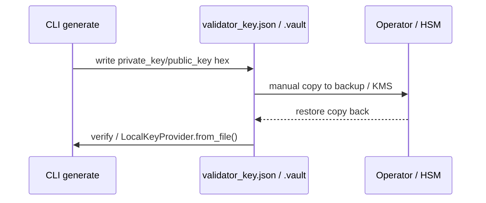

# Key Backup & Restoration

## Overview

HieraChain does **not** have a `security/key_backup_manager.py` or `MasterKeyProvider`. Key backup is operator-managed via two real paths: plain JSON key files produced by the CLI and the optional encrypted `FileVaultProvider` vault. No automatic AES-256-GCM multi-vault distribution or SHA-512 integrity chain exists in code.

---

## Actual Paths

### 1. CLI Plain Backup (default)

**File**: `hierachain/cli/key.py`

```bash
python -m hierachain key generate --output validator_key.json  # Ed25519 hex JSON
python -m hierachain key show --input validator_key.json
python -m hierachain key verify --input validator_key.json
```

* Output is `{private_key, public_key}` hex. Backup = copy `validator_key.json` to secure external storage. Restore = copy back and set `HRC_VALIDATOR_IDENTITY=validator_key.json`.
* No encryption, no hash, no auto-rotation. Operator handles rotation by re-running `generate`.

### 2. Encrypted Vault (dev/test)

**File**: `hierachain/security/key_provider.py` (`FileVaultProvider`)

* Tạo file `.vault` mã hóa bằng `PBKDF2HMAC(SHA256, 310k iter)` rồi dùng `Fernet` (AES-128-CBC với HMAC, không phải AES-256-GCM). Password được truyền vào constructor của `FileVaultProvider`.
* Explicitly documented as *dev/test only*, production should implement `KeyProvider` via HSM/KMS.
* No distribution to multiple vaults, no `metadata.json`, no `retention_period`, no `auto_restore_threshold`.
* `HRC_VAULT_TOKEN` và `HRC_VAULT_PATH` cấu hình backend Vault riêng của `SecretManager`; chúng không cung cấp password cho `FileVaultProvider`.


```mermaid
sequenceDiagram
    participant CLI as CLI generate
    participant File as validator_key.json / .vault
    participant Op as Operator / HSM

    CLI->>File: write private_key/public_key hex
    File->>Op: manual copy to backup / KMS
    Op-->>File: restore copy back
    File->>CLI: verify / LocalKeyProvider.from_file()
```

---

## What Is NOT Implemented

| Documented claim (removed) | Reality |
|---|---|
| `KeyBackupManager.backup_keys()` / `_encrypt_backup_data()` / `SHA-512` / `_distribute_to_locations()` | No such class/methods exist |
| AES-256-GCM + nonce\|\|ciphertext + 3-vault failover | Vault uses `Fernet`; multi-location is manual copy |
| `MasterKeyProvider.get_master_key()` | Không có provider này; chỉ `HRC_MASTER_KEY_SOURCE=env` được chấp nhận làm alias tương thích, còn giá trị nguồn khác và `HRC_MASTER_KEY_FILE` không rỗng sẽ dừng nạp cấu hình |
| Auto backup on MSP cert issue or consensus rotation | No hook; certs in `security/msp.py` are in-memory only |

---

## Operator Checklist

1. Generate: `python -m hierachain key generate -o validator_key.json`
2. Backup: `cp validator_key.json /secure/backup/` (+ encrypt externally if needed)
3. Restore: `cp /secure/backup/validator_key.json ./ && python -m hierachain key verify`
4. Với vault mã hóa: `FileVaultProvider.create_vault(vault_path, password)` và truyền password qua luồng quản lý secret của ứng dụng. `HRC_VAULT_TOKEN` là credential của dịch vụ Vault, không phải password của file vault.

---

## Related

- [MSP Identity](./msp-identity.md): `security/msp.py` issues in-memory certs; no trigger to key backup
- [Encryption & Keys](../security/encryption-keys.md): corrected description of `msp.py`/`key_provider.py`
