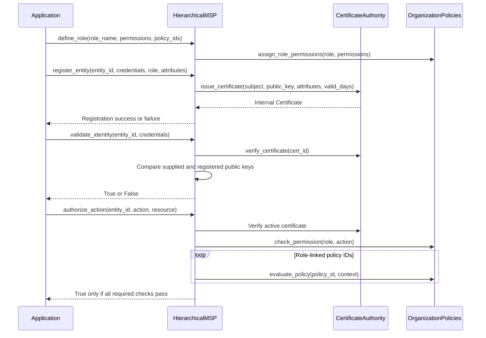

# Danh tính và ủy quyền MSP

## Phạm vi

`IdentityManager` trong `hierachain/security/identity.py` cung cấp đăng ký người dùng, quyền theo vai trò và các hàm hỗ trợ chữ ký. `HierarchicalMSP` trong `hierachain/security/msp.py` quản lý thực thể tổ chức, chứng chỉ nội bộ và `OrganizationPolicies` gắn với vai trò.

Chứng chỉ MSP là dataclass Python `Certificate`, không phải chứng chỉ X.509. CA tạo chữ ký Ed25519 trên ID chứng chỉ, chủ thể và khóa công khai. `verify_certificate()` kiểm tra trạng thái và thời hạn của chứng chỉ đã lưu; nó không xác minh chuỗi X.509 hay chứng minh thực thể sở hữu khóa riêng. Khóa CA, thông tin đăng ký và thu hồi được giữ trong bộ nhớ.

Các route sự kiện Ledger thông thường kiểm tra phạm vi API key và gửi đến Sub-Chain. Chúng không tự động gọi MSP hay `PolicyEngine`. Các luồng Channel áp dụng kiểm tra thành viên và vai trò riêng. Ứng dụng sử dụng giao diện Python phải gọi các bước kiểm tra cần thiết cho thao tác của mình.

## Đăng ký và phân quyền

`credentials` phải chứa `public_key`. Đăng ký trả về `False` khi thất bại, bao gồm trường hợp vai trò chưa được định nghĩa. `validate_identity()` kiểm tra đăng ký, tính hợp lệ của chứng chỉ và khóa công khai được cung cấp; nó không xác minh chữ ký thử thách mới. Dùng luồng xác minh chữ ký riêng khi cần chứng minh quyền sở hữu khóa.

`authorize_action()` yêu cầu thực thể đang hoạt động và chứng chỉ đã lưu còn hợp lệ, kiểm tra quyền theo vai trò, rồi đánh giá mọi chính sách tổ chức được liên kết. Đây là `OrganizationPolicies`, đánh giá dựa trên các thuộc tính ngữ cảnh bắt buộc đã cấu hình. Chúng tách biệt với các quy tắc có kiểu trong `security/policy_engine.py`.

## Vai trò mặc định

| Vai trò | Quyền hạn |
|:-----|:------------|
| `admin` | manage_entities, view_audit_log, define_policies, create_channels, manage_certificates, submit_events, view_channels, query_data, view_data |
| `operator` | submit_events, view_channels, query_data |
| `viewer` | view_data, query_data |

## Thu hồi và lỗi

`revoke_entity(entity_id, reason)` thu hồi chứng chỉ đã lưu và đánh dấu thực thể đã bị thu hồi. Các lần xác thực danh tính và phân quyền thao tác sau đó sẽ thất bại. Chứng chỉ hết hạn hoặc bị thu hồi, thực thể không tồn tại, khóa công khai không khớp và thiếu quyền cũng khiến các bước kiểm tra tương ứng thất bại.

Vòng đời này không có phân phối CRL, sổ đăng ký chứng chỉ bền vững, mTLS hay hook sao lưu khóa tự động. Cấu hình bảo mật truyền tải tại reverse proxy và quản lý sao lưu danh tính riêng.

## Lớp và phương thức chính

| Thao tác | Phương thức | Tệp |
|:----------|:-------|:-----|
| Đăng ký người dùng | `IdentityManager.register_user()` | `hierachain/security/identity.py` |
| Xác thực người dùng | `IdentityManager.validate_identity()` | `hierachain/security/identity.py` |
| Xác minh chữ ký người dùng | `IdentityManager.verify_user_signature()` | `hierachain/security/identity.py` |
| Đăng ký thực thể | `HierarchicalMSP.register_entity()` | `hierachain/security/msp.py` |
| Cấp/xác minh/thu hồi chứng chỉ | Các phương thức `CertificateAuthority` | `hierachain/security/msp.py` |
| Phân quyền thực thể | `HierarchicalMSP.authorize_action()` | `hierachain/security/msp.py` |

## Liên quan

- [Thực thi chính sách](./policy-enforcement.md): các chính sách ABAC có kiểu riêng
- [Gửi sự kiện](./event-submission.md): tiếp nhận vào ledger thông thường
- [Sao lưu khóa](./key-backup.md): sao lưu danh tính do người vận hành quản lý
