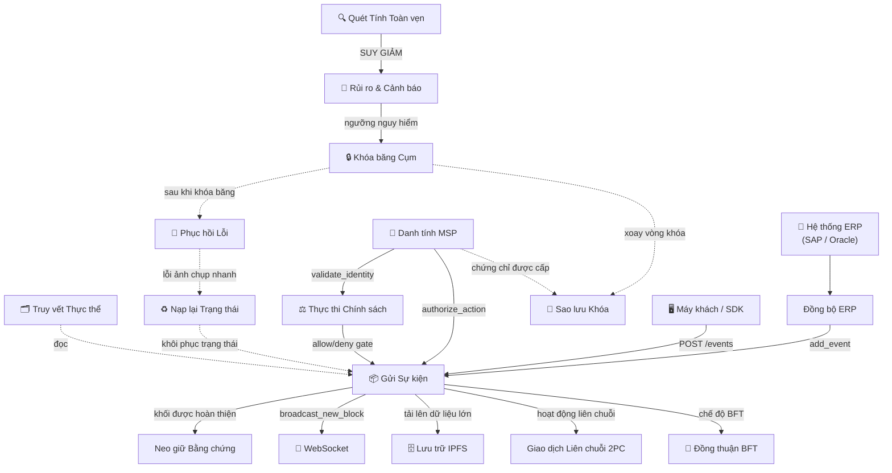

# Tổng quan & Hướng dẫn cho Lập trình viên về Luồng công việc

HieraChain là một **sổ cái blockchain phân cấp thuần Python cấp doanh nghiệp**, được thiết kế như một **Lớp Tiện ích mở rộng (Plugin Layer)** cho cơ sở hạ tầng Web2 hiện có. Thay vì thay thế ngăn xếp mạng doanh nghiệp (vốn đã xử lý TLS/SSL, tường lửa và WAF ở cấp độ API Gateway), HieraChain tập trung hoàn toàn vào việc cung cấp các đặc tính: **Tính Bất biến (Immutability), Niềm tin Phân tán (Distributed Trust), Khả năng Phát hiện Thay đổi (Tamper Evidence) và Chống từ chối (Non-repudiation)**.

Tài liệu này đóng vai trò là tài liệu tham khảo trung tâm cho các lập trình viên về **16 luồng công việc hệ thống** của HieraChain, được tổ chức thành 6 nhóm chức năng. Tài liệu chi tiết về mô hình tương tác thời gian chạy (runtime), tra cứu nhanh và các nguyên tắc dành cho lập trình viên khi đọc, duy trì hoặc bổ sung các luồng công việc mới của hệ thống.

---

## 1. Rào chắn Phát triển Cốt lõi

Khi làm việc với các luồng công việc của HieraChain, lập trình viên **phải** tuân thủ nghiêm ngặt các rào chắn kiến trúc sau đây được định nghĩa trong các quy tắc đồng thuận của dự án:

* **Kiểm duyệt Thuật ngữ Nghiêm ngặt**: HieraChain được thiết kế để theo dõi sổ cái quy trình kinh doanh, **không phải tiền mã hóa**. Không sử dụng thuật ngữ tiền mã hóa trong dữ liệu sự kiện, tên biến, khóa cơ sở dữ liệu hoặc bình luận.

    * ❌ **Từ bị cấm**: `transaction`, `mining`, `coin`, `token`, `wallet`, `address`, `sender`, `receiver`, `amount`, `fee`.
    *  **Từ bắt buộc**: `event` (cho các mục sổ cái), `node` (cho các nút ngang hàng), `msp_id` (cho danh tính), `entity_id` (cho tài sản nghiệp vụ).
    * *Lưu ý*: `CrossChainValidator` sẽ tự động quét các thay đổi (commit) và từ chối bất kỳ mã nguồn nào chứa các từ bị cấm.

* **Ràng buộc về Độ trễ Tối thiểu**: HieraChain áp đặt **độ trễ cơ sở từ 10-20ms**. Hãy giữ cho mã nguồn của luồng công việc ở mức tối giản, nhanh chóng và tối ưu hóa cao. Tránh thêm mã hóa ở cấp độ truyền tải hoặc các trình bao bọc lồng nhau gây ra tải CPU không cần thiết.
* **Không Truy cập Trực tiếp vào Bộ lưu trữ**: Các luồng công việc tuyệt đối không được thực hiện các truy vấn SQL hoặc Redis trực tiếp. Mọi hoạt động truy cập dữ liệu phải sử dụng các bộ chuyển đổi lưu trữ (storage adapters) trong không gian tên `adapters/storage/`.

---

## 2. Tất cả các Luồng công việc: Tra cứu Nhanh

Bảng này cung cấp cái nhìn tổng quan toàn diện về các luồng công việc của HieraChain để lập trình viên tra cứu nhanh:

| Luồng công việc | Nhóm | Kích hoạt | Kết quả | Mô-đun Chính |
|:---------|:------|:--------|:-------|:-----------|
| [Gửi Sự kiện](./event-submission.md) | A | `POST /ledger/chains/{name}/events` | Khối được thêm vào Chuỗi phụ (Sub-Chain) | `hierarchical/sub_chain.py` |
| [Neo giữ Bằng chứng](./proof-anchoring.md) | A | Khối được hoàn thiện trên Chuỗi phụ | Mã băm bằng chứng trên Chuỗi chính (Main Chain) | `hierarchical/main_chain.py` |
| [Giao dịch Liên chuỗi 2PC](./cross-chain-2pc.md) | A | `initiate_cross_chain_transaction()` | `COMMITTED` hoặc `ROLLED_BACK` | `hierarchical/hierarchy_manager.py` |
| [Đồng thuận BFT](./bft-consensus.md) | B | `HRC_MAINCHAIN_CONSENSUS=byzantine_fault_tolerant` | Khối được xác nhận bởi 2f+1 nút xác thực | `consensus/bft/consensus.py` |
| [Khóa băng Cụm](./cluster-lockdown.md) | C | Bất thường vượt quá ngưỡng rủi ro | Tất cả các nút bị khóa băng / tiếp tục | `cluster/lockdown_protocol.py` |
| [Giảm thiểu Lỗi & Phục hồi](./error-recovery.md) | C | Lỗi mạng / hết giờ trưởng nhóm / lỗi toàn vẹn | Trạng thái được khôi phục từ ảnh chụp nhanh | `error_mitigation/recovery_engine.py` |
| [Truy vết Thực thể](./entity-tracing.md) | D | `trace_entity_across_chains(entity_id)` | Nhật ký kiểm toán liên chuỗi hoàn chỉnh | `domains/generic/utils/entity_tracer.py` |
| [Nạp lại Trạng thái Chuỗi](./chain-rehydration.md) | D | Khởi động lại nút hoặc sai lệch mã băm | Chuỗi trong bộ nhớ được đồng bộ với DB | `hierarchical/sub_chain.py` |
| [Xác thực Tính toàn vẹn](./integrity-validation.md) | D | Định kỳ / thủ công / cảnh báo bất thường | Báo cáo `IntegrityReport` (LÀNH MẠNH / SUY GIẢM) | `security/verify/block_verifier.py` |
| [Thực thi Chính sách](./policy-enforcement.md) | E | Mọi hoạt động nhạy cảm về quyền truy cập | `allow` hoặc `deny` cùng với đường dẫn quyết định | `security/policy_engine.py` |
| [Luồng dữ liệu WebSocket](./websocket-streaming.md) | E | Máy khách kết nối tới `/ws/{chain_name}` | Đẩy khối/sự kiện theo thời gian thực | `api/websocket/manager.py` |
| [Lưu trữ Mã hóa IPFS](./ipfs-storage.md) | E | `IPFSClient.upload_json()` | Trả về CID; bản mã được lưu trên IPFS | `api/storage/ipfs_client.py` |
| [Cảnh báo Rủi ro](./risk-alerts.md) | E | Lịch trình của `PerformanceMonitor` | Cảnh báo được gửi đi; chuyển cấp nếu không xác nhận | `monitoring/alert_system.py` |
| [Đồng bộ Tích hợp ERP](./erp-integration.md) | E | Bộ lập lịch `SyncScheduler` | Các sự kiện ERP được gửi tới Chuỗi phụ | `integration/erp_ledger.py` |
| [Danh tính & Xác thực MSP](./msp-identity.md) | F | Đăng ký thực thể / xác thực API | Xác nhận danh tính + ủy quyền hành động | `security/msp.py` |
| [Sao lưu & Khôi phục Khóa](./key-backup.md) | F | Tạo / xoay vòng khóa / khôi phục thảm họa | Bản sao lưu được mã hóa và phân phối; khôi phục khóa | `security/key_backup_manager.py` |

---

## 3. Nhóm chức năng & Phân hệ

Để hợp lý hóa việc hiểu về kiến trúc, các luồng công việc được tổ chức thành sáu khu vực chức năng. Lập trình viên có thể sử dụng bảng điều khiển bên dưới để điều hướng đến nhóm tương ứng khi gỡ lỗi hoặc sửa đổi các phân hệ cốt lõi:

<div class="grid cards" markdown>

* :material-sitemap:{ .lg .middle } __Nhóm A: Các Hoạt động Chuỗi Cốt lõi__

    ---

    Xử lý các đường truyền dữ liệu tiếp nhận, xác thực mật mã và lưu trữ cốt lõi.

    * [Gửi Sự kiện](./event-submission.md)
    * [Neo giữ Bằng chứng](./proof-anchoring.md)
    * [Thao tác Liên chuỗi (2PC)](./cross-chain-2pc.md)

* :material-shield-key:{ .lg .middle } __Nhóm B: Hoàn thiện Đồng thuận__

    ---

    Các cơ chế hoàn thiện khối. Đối với các giải pháp PoA/PoF thay thế, xem [Cơ chế Đồng thuận](./consensus_mechanisms.md).

    * [Đồng thuận BFT (PBFT 3 Giai đoạn)](./bft-consensus.md)

* :material-server-security:{ .lg .middle } __Nhóm C: Quản lý Cụm__

    ---

    Quy trình quản trị tự động, kích hoạt khóa băng trạng thái và khắc phục thảm họa.

    * [Khóa băng Cụm](./cluster-lockdown.md)
    * [Giảm thiểu Lỗi & Phục hồi](./error-recovery.md)

* :material-shield-check:{ .lg .middle } __Nhóm D: Tính Toàn vẹn & Truy vết__

    ---

    Các công cụ kiểm toán vòng đời, nạp lại trạng thái (cold-start) và xác thực tính toàn vẹn hệ thống.

    * [Truy vết Thực thể](./entity-tracing.md)
    * [Nạp lại Trạng thái Chuỗi](./chain-rehydration.md)
    * [Xác thực Tính toàn vẹn](./integrity-validation.md)

* :material-connection:{ .lg .middle } __Nhóm E: Vận hành & Tích hợp__

    ---

    Cổng chính sách bảo mật, đẩy dữ liệu WebSocket thời gian thực, lưu trữ IPFS mã hóa và đồng bộ ERP.

    * [Thực thi Chính sách](./policy-enforcement.md)
    * [Luồng dữ liệu WebSocket](./websocket-streaming.md)
    * [Lưu trữ Mã hóa IPFS](./ipfs-storage.md)
    * [Cảnh báo Rủi ro](./risk-alerts.md)
    * [Đồng bộ Tích hợp ERP](./erp-integration.md)

* :material-key-chain:{ .lg .middle } __Nhóm F: Quản lý Danh tính & Khóa__

    ---

    Đăng ký vòng đời X.509, ủy quyền thành viên tham gia và sao lưu khóa riêng tư trình xác thực được mã hóa.

    * [Danh tính & Xác thực MSP](./msp-identity.md)
    * [Sao lưu & Khôi phục Khóa](./key-backup.md)

</div>

---

## 4. Cách thức Tương tác giữa các Luồng

Sơ đồ dưới đây thể hiện mối quan hệ và các kích hoạt sự kiện khi hệ thống hoạt động giữa tất cả các luồng công việc. Các đường nét liền biểu thị các hoạt động đồng bộ/chặn (blocking), trong khi các đường nét đứt biểu thị các kích hoạt không đồng bộ hoặc dựa trên sự kiện.



### Các Luồng Tích hợp Chính dành cho Lập trình viên

| Chuỗi Tiếp nhận & Bảo mật | Mô tả |
|:---|:---|
| **ERP $\rightarrow$ Đồng bộ ERP $\rightarrow$ Gửi Sự kiện $\rightarrow$ Neo giữ Bằng chứng** | Đường ống tiếp nhận dữ liệu: thay đổi nghiệp vụ $\rightarrow$ sự kiện nội bộ $\rightarrow$ khối Chuỗi phụ $\rightarrow$ mã băm bằng chứng được neo vào Chuỗi chính. |
| **Danh tính MSP $\rightarrow$ Thực thi Chính sách $\rightarrow$ Gửi Sự kiện** | Đường truyền xác thực bảo mật: xác minh chứng chỉ X.509 $\rightarrow$ kiểm tra chính sách ABAC $\rightarrow$ chấp nhận/từ chối sự kiện. |
| **Quét Tính Toàn vẹn $\rightarrow$ Rủi ro & Cảnh báo $\rightarrow$ Khóa băng Cụm $\rightarrow$ Phục hồi Lỗi** | Đường truyền phát hiện bất thường: kiểm toán thất bại $\rightarrow$ gửi cảnh báo $\rightarrow$ đồng thuận trạng thái khóa băng đóng băng cụm $\rightarrow$ tự động khôi phục/khởi tạo lại. |
| **Khóa băng Cụm $\rightarrow$ Sao lưu Khóa** | Xoay vòng khóa độ bảo mật cao: trạng thái đóng băng kích hoạt xoay vòng khóa riêng tư của trình xác thực tự động và tiến hành sao lưu mã hóa. |
| **Phục hồi Lỗi $\rightarrow$ Nạp lại Trạng thái** | Dự phòng đồng bộ trạng thái: việc xác thực ảnh chụp nhanh cục bộ thất bại sẽ kích hoạt việc dựng lại chuỗi trong bộ nhớ từ nhật ký lưu trữ DB. |

---

## 5. Hướng dẫn Lập trình viên: Duy trì Luồng công việc

Khi triển khai các tính năng mới hoặc điều chỉnh hoạt động của hệ thống, hãy giữ cho tài liệu luồng công việc của HieraChain luôn đồng bộ và chính xác:

### Cấu trúc của một Tài liệu Luồng công việc
Mỗi trang luồng công việc riêng lẻ (ví dụ: `event-submission.md`) tuân theo một bố cục nghiêm ngặt và đồng nhất. Nó **phải** bao gồm:

1. **Zensical Front-Matter**: Các siêu dữ liệu YAML tiêu chuẩn bao gồm `title`, `description` và một biểu tượng `icon` trực quan. (Không cho phép tiền tố dạng "WF-number").
2. **Tiêu đề H1 rõ ràng**: `# [Tiêu đề]` khớp chính xác với tiêu đề trong phần front-matter.
3. **Tổng quan (Overview)**: Mô tả ngắn gọn về những gì luồng công việc hoàn thành, bao gồm bối cảnh nghiệp vụ doanh nghiệp.
4. **Sơ đồ luồng (Flow Diagram)**: Sử dụng sơ đồ tuần tự (sequence) hoặc sơ đồ luồng (flowchart) Mermaid độ phân giải cao để trực quan hóa các tương tác thời gian chạy.
5. **Chi tiết Từng Bước (Step-by-Step Breakdown)**: Một bảng Markdown chi tiết liên kết các mã số bước thứ tự với hành động thực tế của lập trình viên.
6. **Xử lý Lỗi (Error Handling)**: Một bảng ánh xạ các trường hợp thất bại (ví dụ: nút ngoại tuyến, lỗi xác thực) với các bước giảm thiểu hoặc khắc phục cụ thể.
7. **Các Lớp & Phương thức Quan trọng (Key Classes & Methods)**: Các con trỏ cấp mã nguồn ánh xạ các bước luồng công việc trực tiếp đến mã nguồn thực tế (ví dụ: `SubChain.add_event()`).
8. **Liên kết liên quan (Related)**: Các liên kết đến các luồng công việc liền kề hoặc phụ thuộc trực tiếp.

### Quy trình Thêm hoặc Sửa đổi một Luồng công việc

1. **Viết Markdown chuẩn**: Lưu các luồng công việc mới dưới đường dẫn `docs/en/workflows/name.md` sử dụng chính xác hệ thống thiết kế hiện tại.
2. **Đăng ký trong mkdocs.yml**: Thêm luồng công việc mới của bạn vào nhánh `Workflows` trong [mkdocs.yml](../../mkdocs.yml) với tên gọn gàng và bóng bẩy.
3. **Quét thuật ngữ**: Đảm bảo không đưa bất kỳ từ vựng tiền mã hóa bị cấm nào vào tài liệu.
4. **Biên dịch và Xác thực**: Chạy lệnh dựng Zensical trong môi trường HieraChain để xác nhận định dạng và tính toàn vẹn của các liên kết:

    ```bash
    zensical build -f mkdocs.yml
    ```
