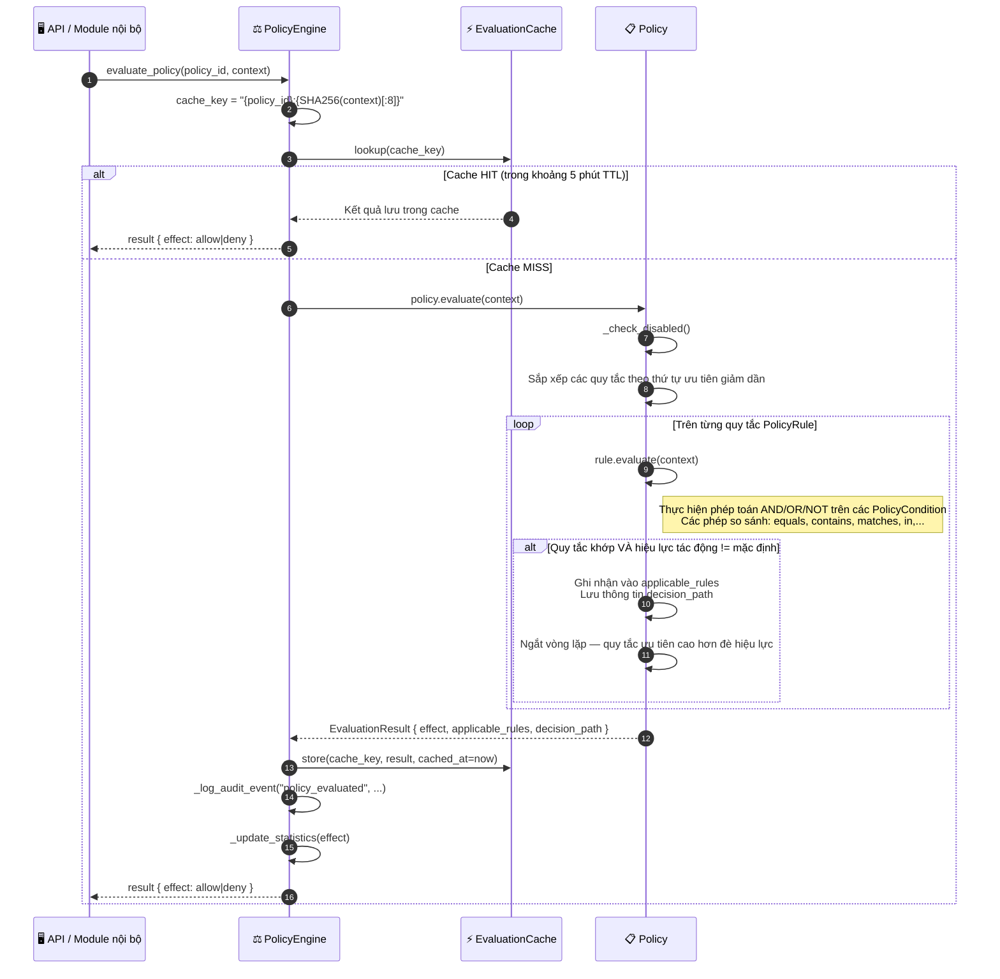

# Thực thi Chính sách (Policy Enforcement)

## Tổng quan

Mọi hoạt động nhạy cảm về mặt bảo mật trong HieraChain đều được kiểm soát nghiêm ngặt bởi `PolicyEngine` (Bộ máy Thực thi Chính sách). Các chính sách bao gồm các nhóm `PolicyRule` được sắp xếp theo mức độ ưu tiên. Để giảm thiểu độ trễ tối đa, kết quả đánh giá được lưu vào cache (thời gian sống TTL là 5 phút, giải phóng theo cơ chế LRU). Tất cả kết quả đánh giá đều được ghi nhận vào nhật ký kiểm toán trong bộ nhớ (in-memory audit log).

`PolicyEngine` đóng vai trò là **cổng ủy quyền duy nhất (single authorization gateway)** — được gọi bởi MSP (Định danh & Ủy quyền MSP) sau khi danh tính được xác minh thành công và ngay trước khi hàm `SubChain.add_event()` (Gửi Sự kiện) được gọi.

---

## Biểu đồ luồng



---

## Cấu trúc Quy tắc Chính sách (Policy Rule Structure)

```python
# Ví dụ chính sách: chỉ cho phép các nhân viên vận hành (operators) hợp lệ gửi sự kiện
policy = Policy(
    policy_id="event_submission_policy",
    name="Event Submission Access",
    effect=PolicyEffect.DENY,       # Hiệu lực tác động mặc định nếu không có quy tắc nào khớp
    rules=[
        PolicyRule(
            rule_id="allow_operators",
            priority=100,
            effect=PolicyEffect.ALLOW,
            conditions=[
                PolicyCondition(field="role", operator="in", value=["admin", "operator"])
            ],
            logic=RuleLogic.AND
        )
    ]
)
```

---

## Các bước thực hiện chi tiết

| Bước | Mô tả |
|:-----|:------|
| **1. Kiểm tra Cache** | Tạo khóa `cache_key = "{policy_id}:{SHA256(context)[:8]}"`. Nếu trúng cache (HIT) và TTL hợp lệ $\rightarrow$ trả về kết quả ngay. |
| **2. Sắp xếp Quy tắc** | Toàn bộ các quy tắc được sắp xếp theo mức độ ưu tiên `priority` giảm dần (các quy tắc có độ ưu tiên cao hơn sẽ được đánh giá trước). |
| **3. Đánh giá Quy tắc** | Mỗi quy tắc kiểm tra danh sách điều kiện `PolicyCondition` của nó theo logic AND/OR/NOT. |
| **4. Ghi đè đầu tiên** | Quy tắc khớp đầu tiên có hiệu lực tác động (effect) khác với mặc định của chính sách sẽ thắng; các quy tắc còn lại sẽ được bỏ qua. |
| **5. Lưu vào Cache** | Kết quả được lưu vào cache kèm dấu thời gian `cached_at` để hết hạn sau 5 phút. |
| **6. Nhật ký kiểm toán**| Mọi kết quả đánh giá đều được ghi nhận vào nhật ký kiểm toán kèm thông tin `policy_id`, `context`, `effect` và `decision_path`. |

---

## Các phép so sánh điều kiện hỗ trợ

| Phép so sánh | Mô tả | Ví dụ |
|:-------------|:------|:------|
| `equals` | Khớp tuyệt đối | `role == "admin"` |
| `not_equals` | Phủ định | `status != "revoked"` |
| `contains` | Tìm chuỗi hoặc phần tử trong danh sách | `permissions contains "submit_events"` |
| `matches` | Biểu thức chính quy (Regex) | `entity_id matches "^product-.*"` |
| `in` | Thuộc một tập hợp | `role in ["admin", "operator"]` |
| `greater_than` | So sánh số lượng lớn hơn | `risk_score > 0.8` |

---

## Xử lý lỗi

| Tình huống | Hành vi |
|:-----------|:--------|
| Không tìm thấy chính sách | Trả về `DENY` (chế độ bảo mật fail-closed) |
| Chính sách bị tắt (disabled) | Trả về ngay lập tức hiệu lực tác động mặc định (không chạy các quy tắc) |
| Context bị thiếu trường thông tin yêu cầu | Điều kiện trả về `False`; ghi nhận log là khớp một phần |
| Cache bị giải phóng (LRU) | Yêu cầu tiếp theo sẽ kích hoạt tính toán và đánh giá chính sách mới |

---

## Các Class & Method quan trọng

| Bước | Class / Method | File |
|:-----|:--------------|:-----|
| Điểm gọi chính | `PolicyEngine.evaluate_policy()` | `security/policy_engine.py` |
| Đánh giá đa chính sách | `PolicyEngine.evaluate_policy_set()` | `security/policy_engine.py` |
| Đánh giá quy tắc | `PolicyRule.evaluate()` | `security/policy_engine.py` |
| Kiểm tra điều kiện | `PolicyCondition.evaluate()` | `security/policy_engine.py` |
| Đọc cache | `_get_cached_result()` | `security/policy_engine.py` |
| Ghi cache | `_cache_result()` | `security/policy_engine.py` |

---

## Liên quan

- [Định danh & Ủy quyền MSP](./msp-identity.md) — MSP gọi hàm `evaluate_policy()` sau khi xác minh danh tính
- [Gửi Sự kiện](./event-submission.md) — Quy trình `add_event()` được bảo vệ nghiêm ngặt bởi bộ máy chính sách
