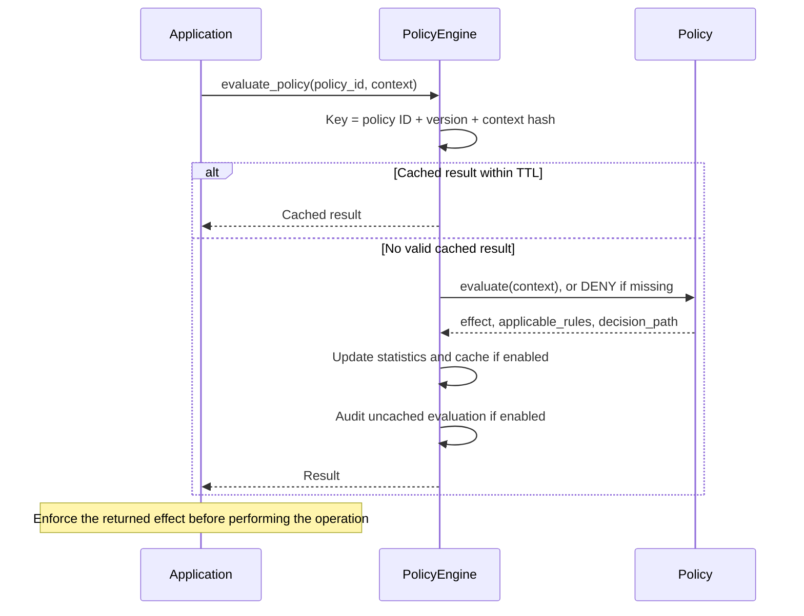

# Thực thi chính sách

## Phạm vi

`PolicyEngine` đánh giá các thao tác được bên gọi chuyển rõ ràng qua nó. Route HTTP và lời gọi Python trực tiếp không có bước kiểm tra ABAC tự động dùng chung. `HierarchicalMSP` dùng `OrganizationPolicies` riêng; nó không gọi engine này.

Một `Policy` chứa các đối tượng `PolicyRule` có kiểu, được sắp theo độ ưu tiên giảm dần. Mỗi quy tắc kết hợp kết quả `PolicyCondition` bằng `LogicalOperator.AND`, `OR` hoặc `NOT`. Quy tắc áp dụng đầu tiên có hiệu lực khác với mặc định của chính sách sẽ quyết định kết quả. Nếu không quy tắc nào ghi đè mặc định, mặc định tiếp tục có hiệu lực. Chính sách bị thiếu hoặc bị tắt trả về `DENY`.

## Luồng đánh giá


```mermaid
sequenceDiagram
    participant Caller as Application
    participant PE as PolicyEngine
    participant Policy as Policy
    Caller->>PE: evaluate_policy(policy_id, context)
    PE->>PE: Key = policy ID + version + context hash
    alt Cached result within TTL
        PE-->>Caller: Cached result
    else No valid cached result
        PE->>Policy: evaluate(context), or DENY if missing
        Policy-->>PE: effect, applicable_rules, decision_path
        PE->>PE: Update statistics and cache if enabled
        PE->>PE: Audit uncached evaluation if enabled
        PE-->>Caller: Result
    end
    Note over Caller: Enforce the returned effect before performing the operation
```

TTL bộ nhớ đệm mặc định là 300 giây với tối đa 1.000 mục. Khóa gồm phiên bản chính sách và tám ký tự thập lục phân đầu tiên của hash SHA-256 từ JSON ngữ cảnh chuẩn hóa. Khi đầy, bộ nhớ đệm loại mục có `cached_at` cũ nhất; cache hit không làm mới thời điểm này. Đánh giá lấy từ cache trả về trước khi ghi mục kiểm toán mới. Bản ghi kiểm toán được giữ trong bộ nhớ.

## Ví dụ chính sách

```python
from hierachain.security.policy_engine import (
    ComparisonOperator,
    LogicalOperator,
    Policy,
    PolicyCondition,
    PolicyEffect,
    PolicyEngine,
    PolicyRule,
    PolicyType,
)

policy = Policy(
    policy_id="event_submission_policy",
    policy_type=PolicyType.ACCESS_CONTROL,
    default_effect=PolicyEffect.DENY,
    rules=[
        PolicyRule(
            rule_id="allow_operators",
            priority=100,
            effect=PolicyEffect.ALLOW,
            conditions=[
                PolicyCondition(
                    attribute="role",
                    operator=ComparisonOperator.IN,
                    value=["admin", "operator"],
                )
            ],
            logical_operator=LogicalOperator.AND,
        )
    ],
)
engine = PolicyEngine()
engine.register_policy(policy)
result = engine.evaluate_policy(policy.policy_id, {"role": "operator"})
assert result["effect"] == PolicyEffect.ALLOW.value
```

Dùng hiệu lực trả về để cho phép hoặc từ chối thao tác. Việc tạo hay đánh giá chính sách không tự động bảo vệ `SubChain.add_event()`.

## Toán tử điều kiện

`ComparisonOperator` hỗ trợ so sánh bằng/khác, lớn hơn/nhỏ hơn (kể cả bằng), chứa, thuộc tập hợp và khớp biểu thức chính quy, bao gồm các dạng phủ định. Điều kiện dùng `attribute`, `operator` và `value`. Thuộc tính ngữ cảnh bị thiếu hoặc phép so sánh thất bại trả về `False`.

## Lớp và phương thức chính

| Thao tác | Phương thức | Tệp |
|:----------|:-------|:-----|
| Một chính sách | `PolicyEngine.evaluate_policy()` | `hierachain/security/policy_engine.py` |
| Tập chính sách | `PolicyEngine.evaluate_policy_set()` | `hierachain/security/policy_engine.py` |
| Đánh giá chính sách | `Policy.evaluate()` | `hierachain/security/policy_engine.py` |
| Đánh giá quy tắc và điều kiện | `PolicyRule.evaluate()` / `PolicyCondition.evaluate()` | `hierachain/security/policy_types.py` |

## Liên quan

- [Danh tính MSP](./msp-identity.md): chính sách thành viên riêng của tổ chức
- [Gửi sự kiện](./event-submission.md): tiếp nhận và kiểm tra phạm vi quyền của route
