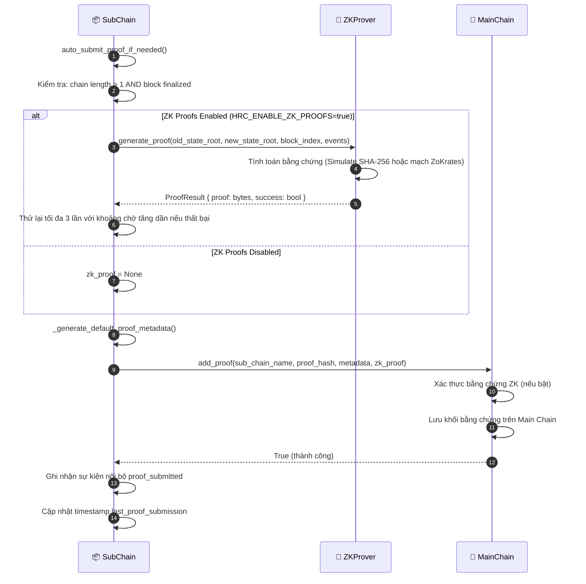

# Neo giữ Bằng chứng (Proof Anchoring)

## Tổng quan

Sau khi một khối được hoàn tất trên Chuỗi con (Sub-Chain), Chuỗi con sẽ gửi một **bằng chứng mã hóa** (hash + bằng chứng ZK tùy chọn) lên Chuỗi chính (Main Chain). Chuỗi chính chỉ lưu trữ bằng chứng này — không bao giờ lưu dữ liệu sự kiện thô. Cơ chế này giúp đảm bảo tính bất biến toàn cục mà không cần lưu trữ dữ liệu miền nhạy cảm trên chuỗi gốc.

Đây là một **cơ chế kích hoạt sau khối (post-block trigger)**, không phải là một lệnh do người dùng yêu cầu. Lệnh này tự động kích hoạt khi `chain_length % proof_interval == 0`.

---

## Biểu đồ luồng

---

## Các bước thực hiện chi tiết

| Bước | Mô tả |
|:-----|:------|
| **1. Kiểm tra kích hoạt** | Lệnh `auto_submit_proof_if_needed()` kiểm tra điều kiện `len(chain) > 1` và khối đã được hoàn tất. |
| **2. Tạo bằng chứng ZK** | Nếu `HRC_ENABLE_ZK_PROOFS=true`: ZKProver tính toán trên `(old_state_root, new_state_root, events)`. Thử lại tối đa 3 lần nếu lỗi. |
| **3. Metadata của bằng chứng** | Lệnh `_generate_default_proof_metadata()` xây dựng cấu trúc `{ sub_chain_name, block_count, latest_hash, timestamp }`. |
| **4. Ghi lên Chuỗi chính** | Lệnh `MainChain.add_proof()` xác thực bằng chứng ZK, sau đó nối thêm khối bằng chứng mới vào Chuỗi chính. |
| **5. Ghi nhận** | Chuỗi con ghi nhật ký sự kiện nội bộ `proof_submitted` và cập nhật timestamp `last_proof_submission`. |

---

## Các chế độ Bằng chứng ZK

| Chế độ | Cơ chế | Trường hợp sử dụng |
|:-------|:-------|:-------------------|
| `mock` | Giả lập mã băm SHA-256 | Phát triển / Kiểm thử |
| `production` | Các mạch ZoKrates ZK-SNARKs | Triển khai thực tế |

---

## Cấu hình

| Cài đặt | Mặc định | Mô tả |
|:--------|:---------|:------|
| `HRC_ENABLE_ZK_PROOFS` | `false` | Bật/tắt xác thực ZK |
| `HRC_ZK_MODE` | `mock` | Chế độ `mock` hoặc `production` |
| `HRC_ZK_PROOF_REQUIRED_FOR_MAINCHAIN` | `false` | Chặn gửi bằng chứng lên Chuỗi chính nếu ZK thất bại |

---

## Xử lý lỗi

| Tình huống | Hành vi |
|:-----------|:--------|
| Lỗi tạo bằng chứng ZK | Thử lại tối đa 3 lần với thời gian chờ tăng dần; nếu `HRC_ZK_PROOF_REQUIRED_FOR_MAINCHAIN=true`, hủy bỏ quy trình |
| Ghi lên Chuỗi chính thất bại | Ghi nhật ký ngoại lệ, không cập nhật `last_proof_submission` — thử lại ở khối tiếp theo |
| Xác thực ZK trên Chuỗi chính thất bại | Lệnh `add_proof()` ném ra ngoại lệ, khối bằng chứng không được nối vào chuỗi |

---

## Các Class & Method quan trọng

| Bước | Class / Method | File |
|:-----|:--------------|:-----|
| Kích hoạt | `SubChain.auto_submit_proof_if_needed()` | `hierarchical/sub_chain.py` |
| Tạo ZK | `ZKProver.generate_proof()` | `security/zk_prover.py` |
| Metadata bằng chứng | `_generate_default_proof_metadata()` | `hierarchical/sub_chain.py` |
| Neo giữ trên Main | `MainChain.add_proof()` | `hierarchical/main_chain.py` |
| Xác thực ZK | `ZKVerifier.verify_proof()` | `security/verify/zk_verifier.py` |

---

## Liên quan

- [Gửi Sự kiện](./event-submission.md) — luồng công việc kích hoạt quy trình này
- [Xác thực Tính toàn vẹn](./integrity-validation.md) — kiểm tra tính nhất quán của bằng chứng giữa Chuỗi con và Chuỗi chính
