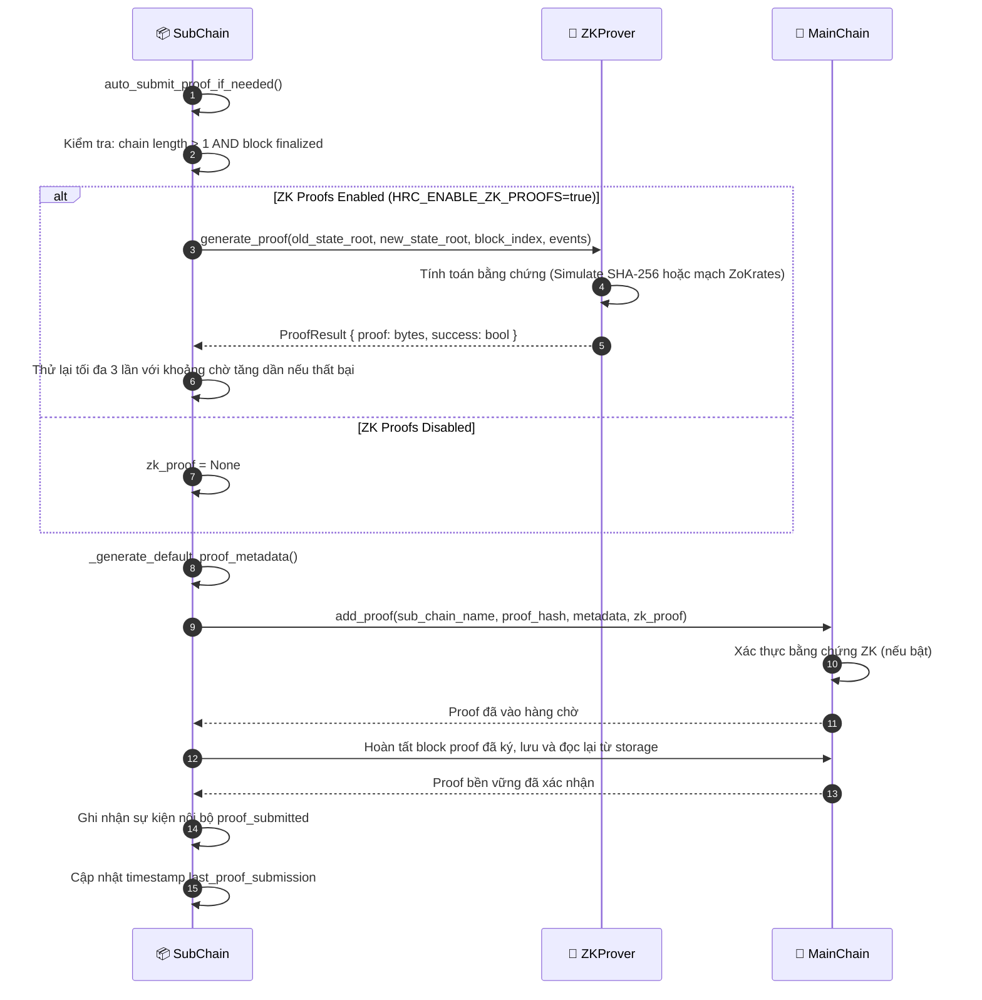

# Neo giữ bằng chứng

## Tổng quan

Sau khi khối hoàn tất trên Sub-Chain, Sub-Chain gửi bằng chứng mã hóa (hash và proof ZK tùy chọn) lên Main Chain. Main Chain chỉ lưu bằng chứng này, không lưu dữ liệu sự kiện thô. Lệnh gửi chỉ thành công sau khi block MainChain chứa proof được ký, hoàn tất, lưu qua SQL bền vững và đọc lại để kiểm tra hash, Merkle root và chữ ký. SQLite dùng WAL với `synchronous=FULL` cho các lần commit này. Storage thiếu hoặc không hỗ trợ sẽ làm lệnh thất bại.

Luồng tự động chạy sau khi block Sub-Chain hoàn tất, khi đã hết khoảng thời gian cấu hình và có block mới chưa được gửi. Endpoint REST có xác thực cũng có thể kích hoạt gửi proof.

---

## Biểu đồ luồng

```mermaid
sequenceDiagram
    autonumber
    participant SC as 📦 SubChain
    participant ZKP as 🔐 ZKProver
    participant MC as 🔗 MainChain

    SC->>SC: auto_submit_proof_if_needed()
    SC->>SC: Kiểm tra: chain length > 1 AND block finalized

    alt ZK Proofs Enabled (HRC_ENABLE_ZK_PROOFS=true)
        SC->>ZKP: generate_proof(old_state_root, new_state_root, block_index, events)
        ZKP->>ZKP: Tính toán bằng chứng (Simulate SHA-256 hoặc mạch ZoKrates)
        ZKP-->>SC: ProofResult { proof: bytes, success: bool }
        SC->>SC: Thử lại tối đa 3 lần với khoảng chờ tăng dần nếu thất bại
    else ZK Proofs Disabled
        SC->>SC: zk_proof = None
    end

    SC->>SC: _generate_default_proof_metadata()
    SC->>MC: add_proof(sub_chain_name, proof_hash, metadata, zk_proof)
    MC->>MC: Xác thực bằng chứng ZK (nếu bật)
    MC-->>SC: Proof đã vào hàng chờ
    SC->>MC: Hoàn tất block proof đã ký, lưu và đọc lại từ storage
    MC-->>SC: Proof bền vững đã xác nhận

    SC->>SC: Ghi nhận sự kiện nội bộ proof_submitted
    SC->>SC: Cập nhật timestamp last_proof_submission
```

---

## Các bước chi tiết

| Bước | Mô tả |
|:-----|:------|
| **1. Kiểm tra kích hoạt** | `auto_submit_proof_if_needed()` kiểm tra thời gian đã trôi qua và có block mới đã hoàn tất. |
| **2. Tạo proof ZK** | Nếu `HRC_ENABLE_ZK_PROOFS=true`: ZKProver tính trên `(old_state_root, new_state_root, events)`. Thử lại tối đa 3 lần nếu lỗi. |
| **3. Metadata proof** | `_generate_default_proof_metadata()` tạo `{ sub_chain_name, block_count, latest_hash, timestamp }`. |
| **4. Ghi lên Main Chain** | `MainChain.add_proof()` xác thực rồi đưa proof vào hàng chờ; đường submit hoàn tất và đọc lại block đã ký từ storage bền vững. |
| **5. Ghi nhận** | Chỉ sau khi đọc lại thành công, Sub-Chain ghi event `proof_submitted` và cập nhật `last_proof_submission`. |

---

## Chế độ proof ZK

| Chế độ | Cơ chế | Trường hợp dùng |
|:-------|:-------|:-------------------|
| `mock` | Mô phỏng băm SHA-256 | Phát triển / kiểm thử |
| `production` | Mạch ZoKrates ZK-SNARKs | Triển khai thực tế |

---

## Cấu hình

| Cài đặt | Mặc định | Mô tả |
|:--------|:---------|:------|
| `HRC_ENABLE_ZK_PROOFS` | `false` | Bật/tắt xác thực ZK |
| `HRC_ZK_MODE` | `mock` | `mock` hoặc `production` |
| `HRC_ZK_REQUIRED_MAINCHAIN` | `false` | Chặn gửi proof lên Main Chain nếu ZK lỗi |

---

## Xử lý lỗi

| Tình huống | Hành vi |
|:-----------|:--------|
| Lỗi tạo proof ZK | Thử lại tối đa 3 lần với chờ tăng dần; nếu `HRC_ZK_REQUIRED_MAINCHAIN=true` thì hủy |
| Ghi lên Main Chain lỗi | Ghi log exception, không cập nhật `last_proof_submission`; thử lại ở khối tiếp theo |
| Thiếu storage bền vững, backend chưa hỗ trợ hoặc đọc lại lỗi | Lệnh trả `False`; retry có thể lưu proof đã chờ hoặc đã hoàn tất mà không ghi bản trùng. |
| Thiếu proof ZK bắt buộc hoặc xác thực thất bại | `MainChain.add_proof()` trả `False`; proof không được ghi |

---

## Lớp và phương thức chính

| Bước | Lớp / Phương thức | Tệp |
|:-----|:--------------|:-----|
| Kích hoạt | `SubChain.auto_submit_proof_if_needed()` | `hierarchical/sub_chain/base.py` |
| Tạo ZK | `ZKProver.generate_proof()` | `security/zk_prover.py` |
| Metadata proof | `_generate_default_proof_metadata()` | `hierarchical/sub_chain/proof.py` |
| Neo lên Main | `MainChain.add_proof()` | `hierarchical/main_chain/base.py` |
| Xác thực ZK | `ZKVerifier.verify()` | `security/verify/zk_verifier.py` |

---

## Liên quan

- [Gửi Sự kiện](./event-submission.md): luồng kích hoạt quy trình này
- [Xác thực Tính toàn vẹn](./integrity-validation.md): kiểm tra nhất quán proof giữa Sub-Chain và Main Chain
