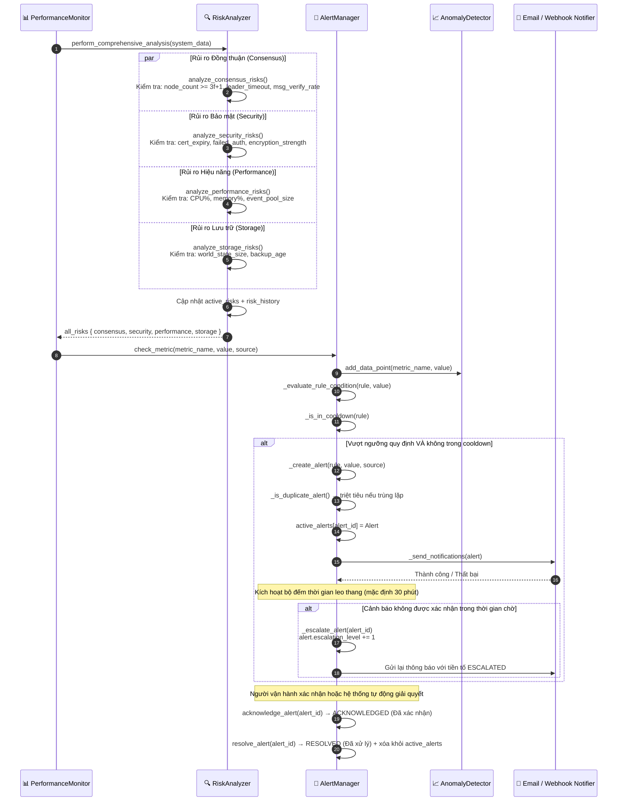

# Cảnh báo Rủi ro (Risk Alerts)

## Tổng quan

HieraChain liên tục theo dõi sức khỏe của toàn bộ hệ thống trên **4 lĩnh vực rủi ro** chính (Đồng thuận, Bảo mật, Hiệu năng, Lưu trữ). Khi các số liệu đo lường vượt ngưỡng quy định, bộ quản lý `AlertManager` sẽ tạo cảnh báo, kiểm soát chống lặp bằng khoảng thời gian làm dịu (cooldown), gửi thông báo qua Email/Webhook và tự động leo thang cảnh báo (escalate) nếu không được xác nhận sau khoảng thời gian chờ cấu hình.

---

## Biểu đồ luồng

---

## Các cấp độ nghiêm trọng của Cảnh báo

| Cấp độ | Ví dụ chỉ số kích hoạt | Tự động leo thang sau |
|:-------|:----------------------|:----------------------|
| `INFO` | Chỉ số dao động bình thường | Không bao giờ |
| `WARNING` | CPU > 85%, phát hiện rủi ro nhỏ | 30 phút |
| `CRITICAL` | CPU > 95%, tỷ lệ đồng thuận thành công < 95% | Ngay lập tức (5 phút) |
| `EMERGENCY` | Người vận hành khai báo thủ công hoặc lỗi kép | Ngay lập tức |

---

## Các lĩnh vực Giám sát Rủi ro

| Lĩnh vực | Các chỉ số chính được kiểm tra |
|:---------|:-------------------------------|
| **Đồng thuận (Consensus)** | Số lượng nút hoạt động `node_count >= 3f+1`, thời gian bầu leader, tỷ lệ xác thực thông điệp |
| **Bảo mật (Security)** | Thời hạn chứng chỉ (số ngày còn lại), tỷ lệ xác thực thất bại, độ mạnh của thuật toán mã hóa |
| **Hiệu năng (Performance)** | Tỷ lệ sử dụng CPU %, RAM %, kích thước hàng đợi sự kiện, độ trễ hoàn tất khối dữ liệu |
| **Lưu trữ (Storage)** | Kích thước cơ sở dữ liệu sổ cái, độ cũ của bản sao lưu (số giờ kể từ lần sao lưu cuối) |

---

## Các bước thực hiện chi tiết

| Bước | Mô tả |
|:-----|:------|
| **1. Phân tích** | Hàm `RiskAnalyzer.perform_comprehensive_analysis()` chạy song song 4 lĩnh vực kiểm tra rủi ro. |
| **2. Kiểm tra chỉ số** | Bộ quản lý `AlertManager.check_metric()` đánh giá từng số liệu nhận về so với các quy tắc thiết lập. |
| **3. Phát hiện bất thường** | Bộ phát hiện `AnomalyDetector` sử dụng baseline thống kê để gắn cờ các điểm dữ liệu bất thường. |
| **4. Kiểm tra làm dịu** | Các quy tắc cảnh báo có cấu hình khoảng thời gian làm dịu (cooldown) để tránh hiện tượng bão cảnh báo (alert storm). |
| **5. Kiểm tra trùng lặp** | Hàm `_is_duplicate_alert()` triệt tiêu thông báo nếu cùng quy tắc + cùng nguồn phát hiện đã có cảnh báo đang hoạt động. |
| **6. Gửi thông báo** | Tiến hành gửi đồng thời thông báo tới Email và/hoặc các Webhook đã được đăng ký cấu hình. |
| **7. Leo thang** | Các cảnh báo không được xác nhận kịp thời sẽ tự động tăng mức độ nguy hiểm: `escalation_level += 1` và gửi lại thông tin. |
| **8. Hoàn tất vòng đời**| Người vận hành xác nhận $\rightarrow$ `ACKNOWLEDGED`; chỉ số hồi phục về mức an toàn $\rightarrow$ `RESOLVED`. |

---

## Xử lý lỗi

| Tình huống | Hành vi |
|:-----------|:--------|
| Lỗi gửi Email thông báo | Đánh dấu cảnh báo cảnh báo; vẫn cố gắng thực hiện gửi thông điệp qua Webhook |
| Endpoint Webhook ngoại tuyến | Thử lại 1 lần; ghi nhận lỗi; đánh dấu cảnh báo là `notification_failed` |
| Bão cảnh báo (quá nhiều tin trùng lặp) | Cơ chế cooldown tự động triệt tiêu các cảnh báo trùng lặp phát ra từ cùng quy tắc |
| RiskAnalyzer ném ra ngoại lệ lỗi | Bắt lỗi ngoại lệ, trả về dữ liệu rủi ro một phần, kích hoạt cảnh báo rủi ro về lỗi phân tích |

---

## Các Class & Method quan trọng

| Bước | Class / Method | File |
|:-----|:--------------|:-----|
| Phân tích rủi ro | `RiskAnalyzer.perform_comprehensive_analysis()` | `risk_management/risk_analyzer.py` |
| Kiểm tra chỉ số | `AlertManager.check_metric()` | `monitoring/alert_system.py` |
| Phát hiện bất thường | `AnomalyDetector.is_anomaly()` | `monitoring/alert_system.py` |
| Khởi tạo cảnh báo | `AlertManager._create_alert()` | `monitoring/alert_system.py` |
| Gửi Email | `EmailNotifier.send_alert()` | `monitoring/alert_system.py` |
| Gửi Webhook | `WebhookNotifier.send_alert()` | `monitoring/alert_system.py` |
| Leo thang cảnh báo | `AlertManager._escalate_alert()` | `monitoring/alert_system.py` |
| Xác nhận cảnh báo | `AlertManager.acknowledge_alert()` | `monitoring/alert_system.py` |

---

## Liên quan

- [Khóa băng Cụm](./cluster-lockdown.md): Các cảnh báo CRITICAL không được xử lý kịp thời có thể tự động kích hoạt khóa băng cụm
- [Xác thực Tính toàn vẹn](./integrity-validation.md): Trạng thái toàn vẹn bị DEGRADED sẽ kích hoạt phát cảnh báo tại đây
