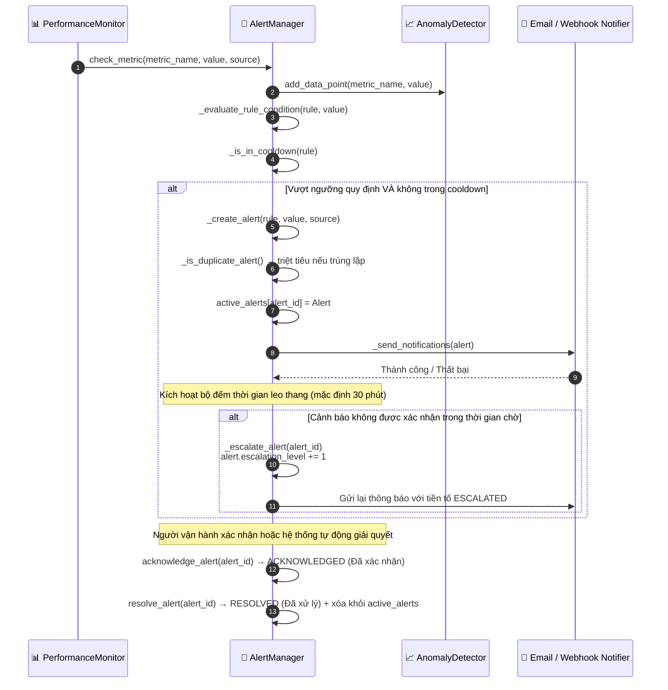

# Cảnh báo rủi ro

## Tổng quan

HieraChain theo dõi sức khỏe hệ thống trên 4 lĩnh vực rủi ro (đồng thuận, bảo mật, hiệu năng, lưu trữ). Khi chỉ số vượt ngưỡng, `AlertManager` tạo cảnh báo, áp dụng cooldown để chống lặp, gửi qua Email/Webhook và tự leo thang nếu không được xác nhận sau thời gian cấu hình.

---

## Biểu đồ luồng

---

## Cấp độ nghiêm trọng

| Cấp độ | Ví dụ chỉ số | Tự leo thang sau |
|:-------|:----------------------|:----------------------|
| `INFO` | Chỉ số dao động bình thường | Không |
| `WARNING` | CPU > 85%, rủi ro nhỏ | 30 phút |
| `CRITICAL` | CPU > 95%, tỷ lệ đồng thuận < 95% | 5 phút |
| `EMERGENCY` | Khai báo thủ công hoặc lỗi kép | Ngay |

---

## Lĩnh vực giám sát rủi ro

| Lĩnh vực | Chỉ số chính |
|:---------|:-------------------------------|
| **Đồng thuận** | `node_count >= 3f+1`, thời gian bầu leader, tỷ lệ xác thực thông điệp |
| **Bảo mật** | Thời hạn chứng chỉ (ngày còn lại), tỷ lệ xác thực lỗi, độ mạnh mã hóa |
| **Hiệu năng** | CPU %, RAM %, kích thước hàng đợi sự kiện, độ trễ hoàn tất khối |
| **Lưu trữ** | Kích thước DB sổ cái, tuổi bản sao lưu (giờ kể từ lần cuối) |

---

## Các bước chi tiết

| Bước | Mô tả |
|:-----|:------|
| **1. Kiểm tra chỉ số** | `AlertManager.check_metric()` so sánh từng chỉ số với quy tắc. |
| **2. Phát hiện bất thường** | `AnomalyDetector` dùng baseline thống kê để gắn cờ điểm bất thường. |
| **3. Kiểm tra cooldown** | Quy tắc có cooldown để tránh bão cảnh báo. |
| **4. Kiểm tra trùng lặp** | `_is_duplicate_alert()` loại bỏ nếu cùng quy tắc và cùng nguồn đã có cảnh báo đang hoạt động. |
| **5. Gửi thông báo** | Gửi đồng thời tới Email và/hoặc Webhook đã cấu hình. |
| **6. Leo thang** | Cảnh báo không xác nhận sẽ tăng `escalation_level += 1` và gửi lại. |
| **7. Hoàn tất vòng đời**| Vận hành xác nhận thành `ACKNOWLEDGED`; chỉ số về mức an toàn thành `RESOLVED`. |

---

## Xử lý lỗi

| Tình huống | Hành vi |
|:-----------|:--------|
| Lỗi gửi Email | Ghi log; vẫn cố gửi qua Webhook |
| Webhook offline | Thử lại 1 lần; ghi log; đánh dấu `notification_failed` |
| Bão cảnh báo (quá nhiều trùng lặp) | Cooldown tự loại bỏ cảnh báo trùng từ cùng quy tắc |

---

## Lớp và phương thức chính

| Bước | Lớp / Phương thức | Tệp |
|:-----|:--------------|:-----|
| Kiểm tra chỉ số | `AlertManager.check_metric()` | `monitoring/alert_system.py` |
| Phát hiện bất thường | `AnomalyDetector.is_anomaly()` | `monitoring/alert_system.py` |
| Tạo cảnh báo | `AlertManager._create_alert()` | `monitoring/alert_system.py` |
| Gửi Email | `EmailNotifier.send_alert()` | `monitoring/alert_system.py` |
| Gửi Webhook | `WebhookNotifier.send_alert()` | `monitoring/alert_system.py` |
| Leo thang | `AlertManager._escalate_alert()` | `monitoring/alert_system.py` |
| Xác nhận | `AlertManager.acknowledge_alert()` | `monitoring/alert_system.py` |

---

## Liên quan

- [Xác thực Tính toàn vẹn](./integrity-validation.md): trạng thái DEGRADED kích hoạt cảnh báo tại đây
