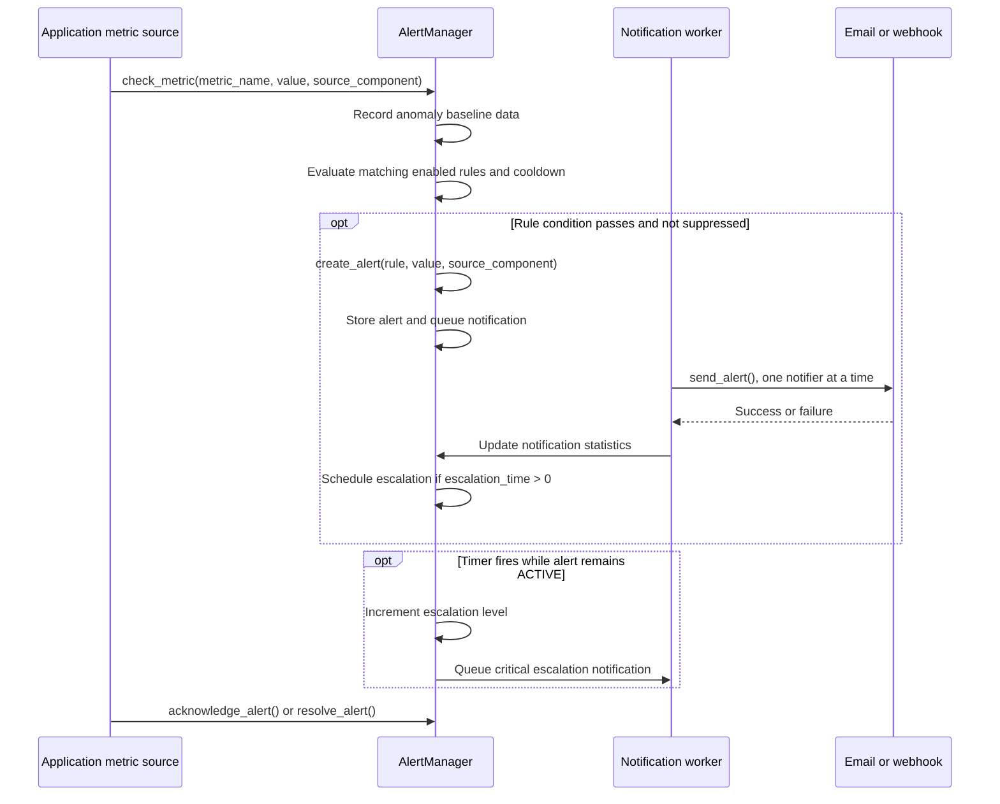

# Cảnh báo rủi ro

## Phạm vi

`AlertManager` trong `hierachain/monitoring/alert_system.py` đánh giá giá trị metric được cung cấp qua `check_metric()`. Ứng dụng chủ kết nối các bộ thu thập metric với phương thức này. Manager không tự động nhận mọi lỗi đồng thuận, chứng chỉ, storage hay báo cáo tính toàn vẹn.

Manager giữ các cảnh báo đang hoạt động và lịch sử có giới hạn trong bộ nhớ. Thiết lập quy tắc điều khiển thời gian chờ giữa các cảnh báo, loại bỏ trùng lặp và nâng cấp. Thông báo dùng một worker với hàng đợi tối đa 128 cảnh báo; worker gọi tuần tự các notifier đã cấu hình.

## Biểu đồ luồng

```mermaid
sequenceDiagram
    participant App as Application metric source
    participant AM as AlertManager
    participant Worker as Notification worker
    participant Notifier as Email or webhook
    App->>AM: check_metric(metric_name, value, source_component)
    AM->>AM: Record anomaly baseline data
    AM->>AM: Evaluate matching enabled rules and cooldown
    opt Rule condition passes and not suppressed
        AM->>AM: create_alert(rule, value, source_component)
        AM->>AM: Store alert and queue notification
        Worker->>Notifier: send_alert(), one notifier at a time
        Notifier-->>Worker: Success or failure
        Worker->>AM: Update notification statistics
        AM->>AM: Schedule escalation if escalation_time > 0
    end
    opt Timer fires while alert remains ACTIVE
        AM->>AM: Increment escalation level
        AM->>Worker: Queue critical escalation notification
    end
    App->>AM: acknowledge_alert() or resolve_alert()
```

## Quy tắc metric mặc định

| Quy tắc | Điều kiện | Mức độ |
|:-----|:----------|:---------|
| `CPU_HIGH` | `cpu_usage > 85` | `WARNING` |
| `CPU_CRITICAL` | `cpu_usage > 95` | `CRITICAL` |
| `MEMORY_HIGH` | `memory_usage > 85` | `WARNING` |
| `CONSENSUS_FAILURE` | `consensus_success_rate < 95` | `CRITICAL` |
| `RISK_DETECTED` | `risk_count > 0` | `WARNING` |

Ứng dụng phải cung cấp các giá trị này. Thêm quy tắc cho metric khác bằng `add_alert_rule()`. `check_metric()` ghi mỗi giá trị làm dữ liệu đường cơ sở cho phát hiện bất thường trước khi đánh giá các quy tắc đang bật khớp metric và thời gian chờ. Quy tắc mặc định không dùng phát hiện bất thường làm điều kiện kích hoạt. Quy tắc được cấu hình rõ với `condition="anomaly"` có thể gọi `AnomalyDetector.is_anomaly()` qua `check_metric()` và kích hoạt cảnh báo khi điều kiện được thỏa mãn.

`AlertRule` mặc định có thời gian chờ 300 giây, thời gian nâng cấp 1.800 giây, bật loại bỏ trùng lặp và `auto_resolve=False`. Chỉ mức độ cảnh báo không quyết định nâng cấp sau năm phút hay ngay lập tức. Xác nhận hoặc giải quyết cảnh báo hủy bộ hẹn giờ đang chờ. Metric trở lại bình thường không tự động giải quyết cảnh báo mặc định.

## Lỗi thông báo

Thao tác email và webhook có thời gian chờ 10 giây. Webhook notifier gửi một yêu cầu; không có cơ chế thử lại tích hợp sẵn. Notifier thất bại làm tăng `notifications_failed`, và notifier tiếp theo đã cấu hình vẫn được thử. Không có trạng thái cảnh báo `notification_failed`.

Nếu hàng đợi thông báo đầy, manager ghi nhận một thông báo thất bại nhưng vẫn giữ cảnh báo trong lịch sử. Gọi `AlertManager.close()` để ngừng tiếp nhận thông báo mới và chờ hoàn tất công việc gửi trong giới hạn đã đặt. Tiến trình thoát đột ngột có thể làm mất thông báo trong hàng đợi và trạng thái cảnh báo trong bộ nhớ.

## Lớp và phương thức chính

| Thao tác | Phương thức | Tệp |
|:----------|:-------|:-----|
| Kiểm tra metric | `AlertManager.check_metric()` | `hierachain/monitoring/alert_system.py` |
| Truy vấn đường cơ sở | `AnomalyDetector.is_anomaly()` | `hierachain/monitoring/alert_system.py` |
| Tạo cảnh báo | `AlertManager.create_alert()` | `hierachain/monitoring/alert_system.py` |
| Thông báo | `EmailNotifier.send_alert()` / `WebhookNotifier.send_alert()` | `hierachain/monitoring/alert_system.py` |
| Nâng cấp | `AlertManager._escalate_alert()` | `hierachain/monitoring/alert_system.py` |
| Mặc định quy tắc | `AlertRule` | `hierachain/monitoring/types.py` |

## Liên quan

- [Kiểm tra tính toàn vẹn hệ thống](./integrity-validation.md): báo cáo mà ứng dụng có thể chuyển thành cảnh báo
- [Giám sát](../modules/monitoring.md): bộ thu thập metric và tích hợp callback
