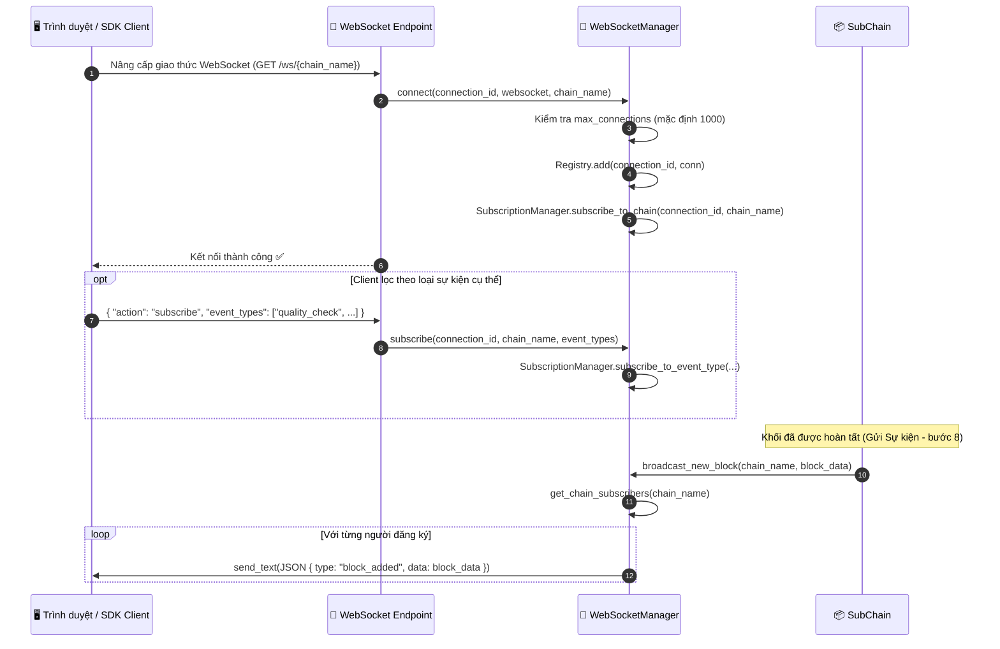
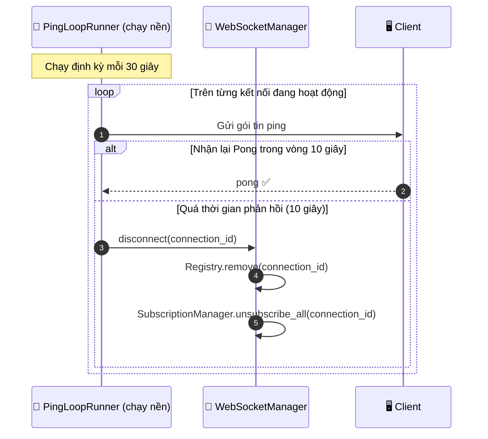

# Luồng dữ liệu WebSocket Thời gian thực (WebSocket Real-Time Streaming)

## Overview

HieraChain tự động đẩy các thông báo về khối mới và sự kiện mới phát sinh tới các máy khách (clients) đang kết nối trong thời gian thực thông qua kết nối WebSocket. Các máy khách có thể chọn đăng ký theo dõi toàn bộ chuỗi cụ thể hoặc theo các loại sự kiện nhất định. Một quy trình vòng lặp ping chạy nền (background ping loop) sẽ giám sát để phát hiện các kết nối rác, mất mạng và tự động giải phóng chúng.

`WebSocketManager` được triển khai dưới dạng **mẫu thiết kế Singleton** (`ws_manager`) dùng chung cho toàn bộ các định tuyến API để quản lý đăng ký kết nối tập trung tại một nơi duy nhất.

---

## Biểu đồ luồng — Vòng đời Kết nối & Phát tin (Broadcast)



---

## Biểu đồ luồng — Vòng lặp Ping / Dọn dẹp kết nối rác



---

## Định dạng Thông điệp (Message Format)

```json
// Thông báo khi có khối dữ liệu mới được thêm vào chuỗi
{
    "type": "block_added",
    "chain": "supply_chain",
    "data": {
        "index": 42,
        "hash": "a3f8b2c1...",
        "previous_hash": "9d1e4f...",
        "timestamp": 1714000000.0,
        "event_count": 5
    }
}

// Thông báo sự kiện (nếu đăng ký lọc cụ thể theo event_types)
{
    "type": "event",
    "chain": "supply_chain",
    "event_type": "quality_check",
    "data": {
        "entity_id": "product-SKU-001",
        "event": "quality_check",
        "details": { "result": "passed" }
    }
}
```

---

## Các bước thực hiện chi tiết

| Bước | Mô tả |
|:-----|:------|
| **1. Nâng cấp giao thức** | Gửi yêu cầu HTTP GET kèm tiêu đề `Upgrade: websocket`. |
| **2. Kiểm tra giới hạn** | Từ chối kết nối mới nếu `active_connections >= max_connections` (mặc định 1000). |
| **3. Đăng ký** | Phương thức `ConnectionRegistry.add()` lưu trữ kết nối dựa trên định danh duy nhất `connection_id`. |
| **4. Đăng ký chuỗi** | Lệnh `SubscriptionManager.subscribe_to_chain()` liên kết kết nối hiện tại với chuỗi tương ứng. |
| **5. Bộ lọc tùy chọn** | Client có thể gửi cấu hình để lọc cụ thể theo danh sách các `event_types`. |
| **6. Phát tin (Broadcast)** | Khi Gửi Sự kiện hoàn tất khối dữ liệu mới, hàm `broadcast_new_block()` phát tin thông báo tới toàn bộ người đăng ký. |
| **7. Vòng lặp Ping** | Luồng nền định kỳ gửi gói tin ping mỗi 30 giây; ngắt kết nối các máy khách không phản hồi quá 10 giây. |

---

## Xử lý lỗi

| Tình huống | Hành vi |
|:-----------|:--------|
| Vượt quá giới hạn kết nối tối đa | Từ chối kết nối mới kèm mã lỗi `1008 Policy Violation` |
| Client ngắt kết nối đột ngột | Phương thức `ConnectionRegistry.remove()` tự động được gọi ở lần gửi lỗi tiếp theo |
| Gửi dữ liệu thất bại do kết nối hỏng | Bắt ngoại lệ gửi tin, gọi phương thức `disconnect()`, xóa kết nối khỏi Registry |
| Phát tin khi không có người đăng ký nào | Bỏ qua (No-op), không sinh lỗi |

---

## Các Class & Method quan trọng

| Bước | Class / Method | File |
|:-----|:--------------|:-----|
| Quản lý dạng Singleton | `ws_manager` | `api/websocket/manager.py` |
| Tạo kết nối | `WebSocketManager.connect()` | `api/websocket/manager.py` |
| Ngắt kết nối | `WebSocketManager.disconnect()` | `api/websocket/manager.py` |
| Đăng ký theo dõi | `WebSocketManager.subscribe()` | `api/websocket/manager.py` |
| Phát tin khối mới | `WebSocketManager.broadcast_new_block()` | `api/websocket/manager.py` |
| Phát tin sự kiện mới | `WebSocketManager.broadcast_event()` | `api/websocket/manager.py` |
| Vòng lặp ping | `PingLoopRunner` | `api/websocket/handlers.py` |
| Xây dựng thông điệp | `build_block_added()` / `build_event_message()` | `api/websocket/builders.py` |
| Kho kết nối | `ConnectionRegistry` | `api/websocket/registry.py` |

---

## Liên quan

- [Gửi Sự kiện](./event-submission.md) — Kích hoạt `broadcast_new_block()` sau khi khối mới được cam kết thành công
- [Cảnh báo Rủi ro](./risk-alerts.md) — Các thông báo cảnh báo cũng được đẩy thời gian thực qua kênh WebSocket này
