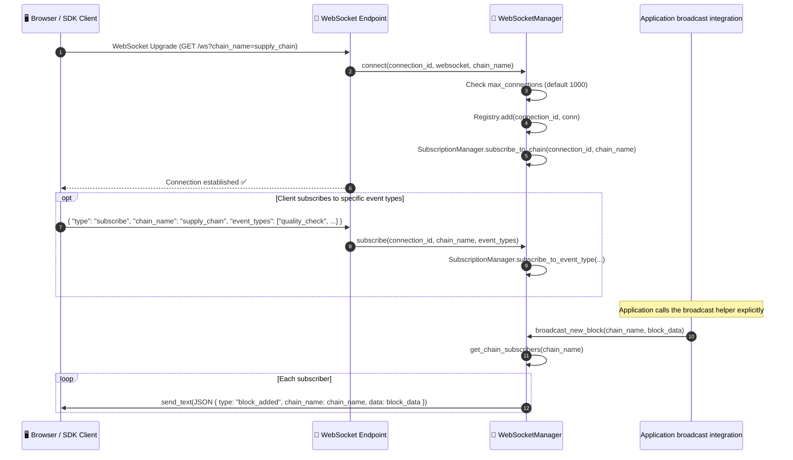

# Luồng dữ liệu WebSocket thời gian thực

## Tổng quan

WebSocket API tiếp nhận đăng ký theo dõi chuỗi/sự kiện và cung cấp các hàm hỗ trợ broadcast. Các luồng commit và sự kiện ledger hiện tại không gọi `broadcast_new_block()` hay `broadcast_event()`. Ứng dụng phải nối nguồn sự kiện với các hàm này để bên đăng ký nhận được thông báo ledger. Tác vụ ping asyncio loại bỏ kết nối khi gửi thất bại hoặc vượt thời gian chờ; nó không chờ pong từ client.

`WebSocketManager` là singleton (`ws_manager`) được các route dùng chung trong một tiến trình API. Mỗi worker có sổ đăng ký kết nối riêng.

## Biểu đồ luồng: vòng đời kết nối và broadcast


```mermaid
sequenceDiagram
    autonumber
    participant Client as 🖥️ Browser / SDK Client
    participant WS as 🔌 WebSocket Endpoint
    participant WSM as 📡 WebSocketManager
    participant SC as Application broadcast integration

    Client->>WS: WebSocket Upgrade (GET /ws?chain_name=supply_chain)
    WS->>WSM: connect(connection_id, websocket, chain_name)
    WSM->>WSM: Check max_connections (default 1000)
    WSM->>WSM: Registry.add(connection_id, conn)
    WSM->>WSM: SubscriptionManager.subscribe_to_chain(connection_id, chain_name)
    WS-->>Client: Connection established ✅

    opt Client subscribes to specific event types
        Client->>WS: { "type": "subscribe", "chain_name": "supply_chain", "event_types": ["quality_check", ...] }
        WS->>WSM: subscribe(connection_id, chain_name, event_types)
        WSM->>WSM: SubscriptionManager.subscribe_to_event_type(...)
    end

    Note over SC: Application calls the broadcast helper explicitly

    SC->>WSM: broadcast_new_block(chain_name, block_data)
    WSM->>WSM: get_chain_subscribers(chain_name)
    loop Each subscriber
        WSM->>Client: send_text(JSON { type: "block_added", chain_name: chain_name, data: block_data })
    end
```

## Biểu đồ luồng: vòng lặp ping và dọn dẹp

```mermaid
sequenceDiagram
    autonumber
    participant BG as 🔄 PingLoopRunner (background)
    participant WSM as 📡 WebSocketManager
    participant Client as 🖥️ Client

    Note over BG: Every 30 seconds

    loop Each active connection
        BG->>Client: send_text JSON ping with 10s timeout
        alt Send succeeds
            Note over BG: Keep connection; no pong wait
        else Send failure or timeout
            BG->>WSM: disconnect(connection_id)
            WSM->>WSM: Registry.remove(connection_id)
            WSM->>WSM: SubscriptionManager.unsubscribe_all(connection_id)
        end
    end
```

## Định dạng thông điệp

```json
// Block added notification (example payload)
{
    "type": "block_added",
    "chain_name": "supply_chain",
    "data": {
        "index": 42,
        "hash": "a3f8b2c1...",
        "previous_hash": "9d1e4f...",
        "timestamp": 1714000000.0,
        "event_count": 5
    },
    "optimized": true,
    "timestamp": "2026-10-09T12:00:00"
}

// Event notification sent by broadcast_event_type() after event-type filtering (example payload)
{
    "type": "event",
    "chain_name": "supply_chain",
    "data": {
        "entity_id": "product-SKU-001",
        "event": "quality_check",
        "details": { "result": "passed" }
    },
    "optimized": true,
    "timestamp": "2026-10-09T12:00:00",
    "event_type": "quality_check"
}
```

`broadcast_new_block()` bọc `block_data` do ứng dụng cung cấp. Hàm này không xác nhận block đã được commit bền vững; hãy gọi sau khi ứng dụng xác lập trạng thái block muốn thông báo.

## Các bước chi tiết

| Bước | Mô tả |
|:-----|:------------|
| 1. Upgrade | Kết nối đến `/ws`, có thể truyền tham số truy vấn `chain_name` |
| 2. Kiểm tra giới hạn | Từ chối nếu `active_connections >= max_connections` (mặc định 1000). |
| 3. Đăng ký | `ConnectionRegistry.add()` lưu kết nối theo `connection_id`. |
| 4. Đăng ký chuỗi | `SubscriptionManager.subscribe_to_chain()` liên kết kết nối với chuỗi. |
| 5. Bộ lọc tùy chọn | Chỉ `broadcast_event_type()` áp dụng subscription theo loại event; `broadcast_event()` gửi tới mọi subscriber của chain. |
| 6. Broadcast | Lời gọi `broadcast_new_block()` từ ứng dụng gửi đến các bên đăng ký |
| 7. Vòng lặp ping | Tác vụ asyncio gửi ping JSON mỗi 30 giây; gửi thất bại hoặc hết thời gian chờ gửi 10 giây sẽ ngắt kết nối |

## Xử lý lỗi

| Tình huống | Hành vi |
|:----------|:---------|
| Vượt giới hạn kết nối | `WebSocketManager.connect()` phát sinh `Exception` chung; endpoint bắt và ghi log, sau đó chạy cleanup. Endpoint không gửi rõ mã đóng `1008`. |
| Client ngắt đột ngột | `ConnectionRegistry.remove()` được gọi ở lần gửi lỗi tiếp theo |
| Gửi lỗi do kết nối hỏng | Bắt exception, gọi `disconnect()`, xóa khỏi Registry |
| Broadcast khi không có subscriber | Bỏ qua (No-op), không lỗi |

## Lớp và phương thức chính

| Bước | Lớp / Phương thức | Tệp |
|:-----|:--------------|:-----|
| Singleton | `ws_manager` | `api/websocket/manager.py` |
| Tạo kết nối | `WebSocketManager.connect()` | `api/websocket/manager.py` |
| Ngắt kết nối | `WebSocketManager.disconnect()` | `api/websocket/manager.py` |
| Đăng ký | `WebSocketManager.subscribe()` | `api/websocket/manager.py` |
| Phát khối mới | `WebSocketManager.broadcast_new_block()` | `api/websocket/manager.py` |
| Phát sự kiện mới | `WebSocketManager.broadcast_event()` | `api/websocket/manager.py` |
| Vòng lặp ping | `PingLoopRunner` | `api/websocket/handlers.py` |
| Xây dựng thông điệp | `build_block_added()` / `build_event_message()` | `api/websocket/builders.py` |
| Kho kết nối | `ConnectionRegistry` | `api/websocket/registry.py` |

## Liên quan

- [Gửi sự kiện](./event-submission.md): pipeline ledger mà ứng dụng có thể nối với các hàm hỗ trợ broadcast
- [Phân tích rủi ro và cảnh báo](./risk-alerts.md): quy trình thông báo email/webhook riêng
