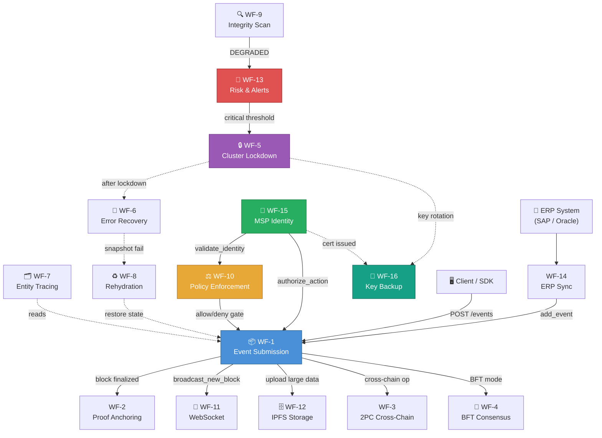

# HieraChain — Workflow Reference

HieraChain is a **pure Python, enterprise-grade hierarchical blockchain ledger** designed as a plugin layer for existing Web2 enterprise infrastructure. It adds blockchain value that Web2 lacks: **immutability, distributed trust, tamper evidence, and non-repudiation** — without replacing security layers (TLS, WAF, API Gateway) that already exist in the enterprise stack.

This document covers **16 system workflows** organized into 6 functional groups. Each workflow describes the data flow, key classes, and interactions within its scope. Individual workflow pages contain full sequence/flow diagrams, step-by-step breakdowns, and error handling details.

> **Related documents**: [CODEBASE_REFERENCE.md](../CODEBASE_REFERENCE.md) · [DEV_GUIDE.md](../DEV_GUIDE.md) · [ARCHITECTURE.md](../ARCHITECTURE.md) · [Consensus Mechanisms](./consensus_mechanisms.md)

---

## All Workflows — Quick Reference

| WF                                          | Name | Group | Trigger | Output | Key Module |
|:--------------------------------------------|:-----|:------|:--------|:-------|:-----------|
| [WF-1](./wf-01-event-submission.md)         | Event Submission | A | `POST /v1/chains/{name}/events` | Block appended to Sub-Chain | `hierarchical/sub_chain.py` |
| [WF-2](./wf-02-proof-anchoring.md)          | Proof Anchoring | A | Block finalized on Sub-Chain | Proof hash on Main Chain | `hierarchical/main_chain.py` |
| [WF-3](./wf-03-cross-chain-2pc.md)          | Cross-Chain 2PC | A | `initiate_cross_chain_transaction()` | `COMMITTED` or `ROLLED_BACK` | `hierarchical/hierarchy_manager.py` |
| [WF-4](./wf-04-bft-consensus.md)            | BFT Consensus | B | `HRC_CONSENSUS_TYPE=byzantine_fault_tolerant` | Block committed by 2f+1 validators | `consensus/bft/consensus.py` |
| [WF-5](./wf-05-cluster-lockdown.md)         | Cluster Lockdown | C | Anomaly exceeds risk threshold | All nodes frozen / resumed | `cluster/cluster_lockdown.py` |
| [WF-6](./wf-06-error-recovery.md)           | Error Mitigation | C | Network fail / leader timeout / integrity error | State restored from snapshot | `error_mitigation/recovery_engine.py` |
| [WF-7](./wf-07-entity-tracing.md)           | Entity Tracing | D | `trace_entity_across_chains(entity_id)` | Complete cross-chain audit trail | `domains/generic/utils/entity_tracer.py` |
| [WF-8](./wf-08-chain-rehydration.md)        | Chain Rehydration | D | Node restart or hash divergence | In-memory chain synced to DB | `hierarchical/sub_chain.py` |
| [WF-9](./wf-09-integrity-validation.md)     | Integrity Validation | D | Periodic / manual / WF-13 anomaly | `IntegrityReport` (HEALTHY / DEGRADED) | `security/verify/block_verifier.py` |
| [WF-10](./wf-10-policy-enforcement.md)      | Policy Enforcement | E | Any access-sensitive operation | `allow` or `deny` with decision path | `security/policy_engine.py` |
| [WF-11](./wf-11-websocket-streaming.md)     | WebSocket Streaming | E | Client connects to `/ws/{chain_name}` | Real-time block/event push | `api/websocket/manager.py` |
| [WF-12](./wf-12-ipfs-storage.md)            | IPFS Encrypted Storage | E | `IPFSClient.upload_json()` | CID returned; ciphertext on IPFS | `api/storage/ipfs_client.py` |
| [WF-13](./wf-13-risk-alerts.md)             | Risk Analysis & Alerts | E | `PerformanceMonitor` schedule | Alerts dispatched; escalation on no-ack | `monitoring/alert_system.py` |
| [WF-14](./wf-14-erp-integration.md)         | ERP Integration Sync | E | `SyncScheduler` timer | ERP events submitted to Sub-Chain | `integration/erp_ledger.py` |
| [WF-15](./wf-15-msp-identity.md)            | MSP Identity & Auth | F | Entity registration / API auth | Identity confirmed + action authorized | `security/msp.py` |
| [WF-16](./wf-16-key-backup.md)              | Key Backup & Restoration | F | Key generation / rotation / disaster recovery | Encrypted backup distributed; keys restored | `security/key_backup_manager.py` |

---

## Workflow Groups

### Group A — Core Chain Operations

Covers the fundamental data path: from an external system submitting a business event, through consensus finalization, to proof anchoring on the Main Chain. Cross-chain atomicity (2PC) is also handled here.

| WF | Name | Page                                                            |
|:---|:-----|:----------------------------------------------------------------|
| WF-1 | Event Submission | [wf-01-event-submission.md](./wf-01-event-submission.md)        |
| WF-2 | Proof Anchoring | [wf-02-proof-anchoring.md](./wf-02-proof-anchoring.md)          |
| WF-3 | Cross-Chain Transaction (2PC) | [wf-03-cross-chain-2pc.md](./wf-03-cross-chain-2pc.md)          |

---

### Group B — Consensus Finalization

The BFT (3-phase PBFT) consensus mechanism activated for adversarial environments. For PoA and PoF mechanisms (the simpler alternatives), see [Consensus Mechanisms](./consensus_mechanisms.md).

| WF | Name | Page                                               |
|:---|:-----|:---------------------------------------------------|
| WF-4 | BFT Consensus (3-Phase PBFT) | [wf-04-bft-consensus.md](./wf-04-bft-consensus.md) |

---

### Group C — Cluster Management & Recovery

Cluster-level resilience: coordinated lockdown via gossip quorum (WF-5), and layered auto-recovery for network failures, leader failures, and state rollback (WF-6).

| WF | Name | Page                                                          |
|:---|:-----|:--------------------------------------------------------------|
| WF-5 | Cluster Lockdown & Recovery | [wf-05-cluster-lockdown.md](./wf-05-cluster-lockdown.md)      |
| WF-6 | Error Mitigation & Recovery | [wf-06-error-recovery.md](./wf-06-error-recovery.md)          |

---

### Group D — Data Integrity & Traceability

Cross-chain entity auditing (WF-7), in-memory chain rehydration from DB (WF-8), and system-wide tamper detection (WF-9).

| WF | Name | Page                                                                      |
|:---|:-----|:--------------------------------------------------------------------------|
| WF-7 | Entity Tracing | [wf-07-entity-tracing.md](./wf-07-entity-tracing.md)                      |
| WF-8 | Chain Rehydration | [wf-08-chain-rehydration.md](./wf-08-chain-rehydration.md)                |
| WF-9 | System Integrity Validation | [wf-09-integrity-validation.md](./wf-09-integrity-validation.md)          |

---

### Group E — Operational & Integration Layer

Policy gating (WF-10), real-time WebSocket streaming (WF-11), encrypted IPFS storage (WF-12), risk monitoring and alerting (WF-13), and ERP sync ingestion bridge (WF-14).

| WF | Name | Page                                                                 |
|:---|:-----|:---------------------------------------------------------------------|
| WF-10 | Policy Enforcement | [wf-10-policy-enforcement.md](./wf-10-policy-enforcement.md)         |
| WF-11 | WebSocket Real-Time Streaming | [wf-11-websocket-streaming.md](./wf-11-websocket-streaming.md)       |
| WF-12 | IPFS Encrypted Storage | [wf-12-ipfs-storage.md](./wf-12-ipfs-storage.md)                     |
| WF-13 | Risk Analysis & Alert Lifecycle | [wf-13-risk-alerts.md](./wf-13-risk-alerts.md)                       |
| WF-14 | ERP Integration Sync | [wf-14-erp-integration.md](./wf-14-erp-integration.md)               |

---

### Group F — Security Identity & Key Management

Enterprise-grade identity lifecycle via MSP and X.509 certificates (WF-15), and cryptographic key backup/restoration with AES-256-GCM and SHA-512 integrity (WF-16).

| WF | Name | Page                                                  |
|:---|:-----|:------------------------------------------------------|
| WF-15 | MSP Identity & Authorization | [wf-15-msp-identity.md](./wf-15-msp-identity.md)      |
| WF-16 | Key Backup & Restoration | [wf-16-key-backup.md](./wf-16-key-backup.md)          |

---

## How Workflows Interact

The diagram below shows the runtime trigger relationships between all 16 workflows. Solid arrows indicate direct calls; dashed arrows indicate background/async triggers.

### Key Interaction Chains

| Chain | Description |
|:------|:------------|
| **ERP → WF-14 → WF-1 → WF-2** | Core ingestion pipeline: ERP change → ledger event → Sub-Chain block → Main Chain proof |
| **WF-15 → WF-10 → WF-1** | Security gate: identity verified → policy evaluated → event accepted |
| **WF-9 → WF-13 → WF-5 → WF-6** | Incident response: tamper detected → alert → cluster freeze → system recovery |
| **WF-5 → WF-16** | Security hardening: lockdown triggers key rotation → key backup |
| **WF-6 → WF-8** | State recovery: snapshot fails → full chain rehydration from DB |
