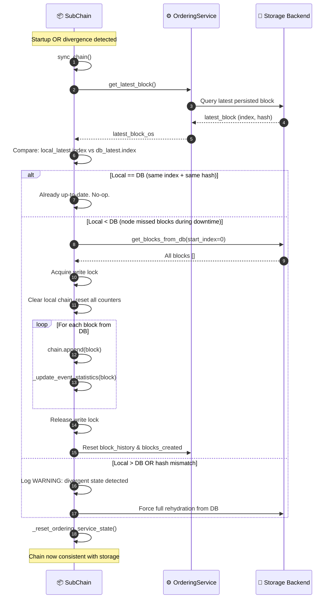

# WF-8: Chain Rehydration

**Group**: D — Data Integrity & Traceability
**Trigger**: Sub-Chain node restart OR `sync_chain()` detects local hash ≠ DB hash
**Output**: In-memory chain state synchronized to the authoritative DB state
**Key modules**: `hierarchical/sub_chain.py`, `consensus/ordering/service.py`, `adapters/storage/`

> [← WF-7: Entity Tracing](./wf-07-entity-tracing.md) · [Back to Overview](../ARCHITECTURE.md) · [WF-9: Integrity Validation →](./wf-09-integrity-validation.md)

---

## Overview

When a Sub-Chain node **restarts** or detects a **divergent state** (local hash ≠ DB hash), it rehydrates its in-memory chain from the persistent storage backend. This ensures consistency after crashes, restarts, or network partitions.

The DB is always the **authoritative source of truth**. If local state diverges, it is discarded and rebuilt from DB.

---

## Flow Diagram

---

## Divergence Scenarios

| Scenario | Detection | Action |
|:---------|:----------|:-------|
| **Cold start** | `local.index == 0` | Load all blocks from DB |
| **Crash recovery** | `local.index < db.index` | Append missing blocks only |
| **Hash mismatch** | `local.hash != db.hash` (same index) | Full rehydration from DB |
| **Already in sync** | `local.index == db.index AND hash matches` | No-op |
| **Local ahead of DB** | `local.index > db.index` | WARNING — DB is authoritative; force rehydrate |

---

## Step-by-Step Breakdown

| Step | Description |
|:-----|:------------|
| **1. Trigger** | Node startup calls `sync_chain()`, or `auto_sync` timer fires |
| **2. DB query** | `OrderingService.get_latest_block()` fetches the latest persisted block from storage |
| **3. Comparison** | Compare local chain `(index, hash)` with DB `(index, hash)` |
| **4. Up-to-date** | If identical: skip. Normal operations resume immediately |
| **5. Partial sync** | If `local < db`: load only the delta blocks. Acquires write lock to prevent race conditions |
| **6. Full rehydration** | If hash mismatch or local ahead: discard local, rebuild entirely from DB |
| **7. Statistics reset** | `_update_event_statistics()` rebuilds `entity_event_index` from each block |
| **8. OrderingService reset** | Sync block counters between chain and ordering service |

---

## Error Handling

| Condition | Behavior |
|:----------|:---------|
| DB read fails during rehydration | Exception logged, retry on next sync interval |
| Write lock held too long | Timeout after `lock_timeout` seconds; critical alert via WF-13 |
| `entity_event_index` inconsistent after rehydration | Full index rebuild triggered |
| Storage backend unreachable | Node enters read-only mode; new events queued but not persisted |

---

## Key Classes & Methods

| Step | Class / Method | File |
|:-----|:--------------|:-----|
| Entry point | `SubChain.sync_chain()` | `hierarchical/sub_chain.py` |
| Latest DB block | `OrderingService.get_latest_block()` | `consensus/ordering/service.py` |
| Load all blocks | `storage.get_blocks_from_db()` | `adapters/storage/sqlite_adapter.py` |
| Rebuild index | `SubChain._update_event_statistics()` | `hierarchical/sub_chain.py` |
| Reset OS counters | `SubChain._reset_ordering_service_state()` | `hierarchical/sub_chain.py` |

---

## See Also

- [WF-6: Error Mitigation](./wf-06-error-recovery.md) — rollback triggers rehydration when snapshot fails
- [WF-9: System Integrity Validation](./wf-09-integrity-validation.md) — validates chain consistency after rehydration
