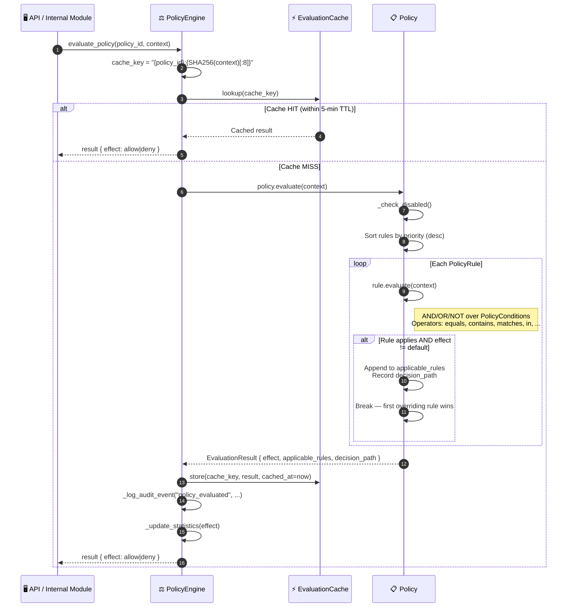

# WF-10: Policy Enforcement

**Group**: E — Operational & Integration Layer
**Trigger**: Any access-sensitive API request or internal operation requiring authorization
**Output**: `EvaluationResult { effect: "allow" | "deny", decision_path, applicable_rules }`
**Key modules**: `security/policy_engine.py`

> [← WF-9: Integrity Validation](./wf-09-integrity-validation.md) · [Back to Overview](../ARCHITECTURE.md) · [WF-11: WebSocket Streaming →](./wf-11-websocket-streaming.md)

---

## Overview

Every access-sensitive operation in HieraChain is gated by the `PolicyEngine`. Policies are composed of typed `PolicyRule` sets with priority ordering. Results are cached (5-minute TTL, LRU eviction) to minimize latency overhead. All evaluations are written to an in-memory audit log.

The `PolicyEngine` acts as the **single authorization gateway** — it is called by MSP (WF-15) after identity is verified, and before `SubChain.add_event()` (WF-1) is invoked.

---

## Flow Diagram



---

## Policy Rule Structure

```python
# Example policy: restrict event submission to authorized operators only
policy = Policy(
    policy_id="event_submission_policy",
    name="Event Submission Access",
    effect=PolicyEffect.DENY,       # Default effect if no rule overrides
    rules=[
        PolicyRule(
            rule_id="allow_operators",
            priority=100,
            effect=PolicyEffect.ALLOW,
            conditions=[
                PolicyCondition(field="role", operator="in", value=["admin", "operator"])
            ],
            logic=RuleLogic.AND
        )
    ]
)
```

---

## Step-by-Step Breakdown

| Step | Description |
|:-----|:------------|
| **1. Cache check** | `cache_key = "{policy_id}:{SHA256(context)[:8]}"`. If cache HIT and TTL valid → return immediately |
| **2. Rule sort** | All rules sorted by `priority` descending (higher priority evaluated first) |
| **3. Rule evaluation** | Each rule checks its `PolicyCondition` list using AND/OR/NOT logic |
| **4. First override** | The first rule whose effect differs from the policy default wins; remaining rules skipped |
| **5. Cache store** | Result cached with `cached_at` timestamp for 5-minute TTL |
| **6. Audit log** | Every evaluation logged with `policy_id`, `context`, `effect`, and `decision_path` |

---

## Supported Condition Operators

| Operator | Description | Example |
|:---------|:------------|:--------|
| `equals` | Exact match | `role == "admin"` |
| `not_equals` | Negation | `status != "revoked"` |
| `contains` | String/list containment | `permissions contains "submit_events"` |
| `matches` | Regex match | `entity_id matches "^product-.*"` |
| `in` | Set membership | `role in ["admin", "operator"]` |
| `greater_than` | Numeric comparison | `risk_score > 0.8` |

---

## Error Handling

| Condition | Behavior |
|:----------|:---------|
| Policy not found | Returns `DENY` (fail-closed) |
| Policy disabled | Returns default effect immediately (no rule eval) |
| Context missing required field | Condition evaluates to `False`; logged as partial match |
| Cache evicted (LRU) | Next request triggers fresh evaluation |

---

## Key Classes & Methods

| Step | Class / Method | File |
|:-----|:--------------|:-----|
| Entry point | `PolicyEngine.evaluate_policy()` | `security/policy_engine.py` |
| Multi-policy eval | `PolicyEngine.evaluate_policy_set()` | `security/policy_engine.py` |
| Rule evaluation | `PolicyRule.evaluate()` | `security/policy_engine.py` |
| Condition check | `PolicyCondition.evaluate()` | `security/policy_engine.py` |
| Cache lookup | `_get_cached_result()` | `security/policy_engine.py` |
| Cache store | `_cache_result()` | `security/policy_engine.py` |

---

## See Also

- [WF-15: MSP Identity](./wf-15-msp-identity.md) — MSP calls `evaluate_policy()` after identity verified
- [WF-1: Event Submission](./wf-01-event-submission.md) — `add_event()` guarded by policy evaluation
