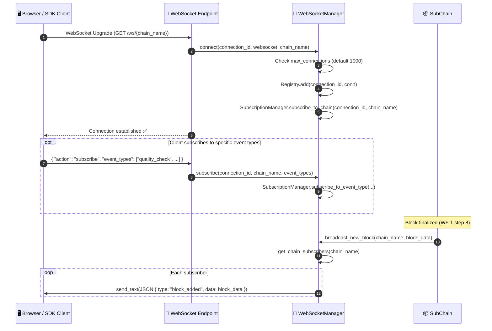
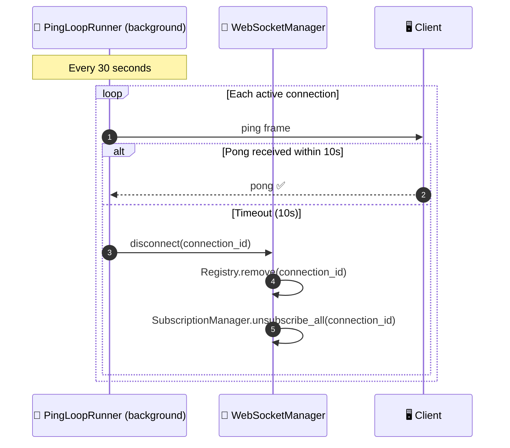

# WF-11: WebSocket Real-Time Streaming

**Group**: E — Operational & Integration Layer
**Trigger**: Client opens WebSocket connection to `/ws/{chain_name}`
**Output**: Real-time block and event notifications pushed to subscribed clients
**Key modules**: `api/websocket/manager.py`, `api/websocket/registry.py`, `api/websocket/builders.py`

> [← WF-10: Policy Enforcement](./wf-10-policy-enforcement.md) · [Back to Overview](../ARCHITECTURE.md) · [WF-12: IPFS Storage →](./wf-12-ipfs-storage.md)

---

## Overview

HieraChain pushes block and event notifications to connected clients in real-time via WebSocket. Clients subscribe to specific chains or event types. A background ping loop detects stale connections and removes them automatically.

The `WebSocketManager` is a **singleton** (`ws_manager`) used across all API routes to ensure a single connection registry.

---

## Flow Diagram — Connection & Broadcast Lifecycle



---

## Flow Diagram — Ping / Stale Connection Cleanup



---

## Message Format

```json
// Block added notification
{
    "type": "block_added",
    "chain": "supply_chain",
    "data": {
        "index": 42,
        "hash": "a3f8b2c1...",
        "previous_hash": "9d1e4f...",
        "timestamp": 1714000000.0,
        "event_count": 5
    }
}

// Event notification (if subscribed to event_types)
{
    "type": "event",
    "chain": "supply_chain",
    "event_type": "quality_check",
    "data": {
        "entity_id": "product-SKU-001",
        "event": "quality_check",
        "details": { "result": "passed" }
    }
}
```

---

## Step-by-Step Breakdown

| Step | Description |
|:-----|:------------|
| **1. Upgrade** | HTTP GET with `Upgrade: websocket` header |
| **2. Capacity check** | Reject if `active_connections >= max_connections` (default 1000) |
| **3. Register** | `ConnectionRegistry.add()` stores connection by `connection_id` |
| **4. Subscribe** | `SubscriptionManager.subscribe_to_chain()` links connection to chain |
| **5. Optional filter** | Client can narrow to specific `event_types` |
| **6. Broadcast** | After WF-1 finalizes a block, `broadcast_new_block()` fans out to all subscribers |
| **7. Ping loop** | Background thread pings every 30s; removes unresponsive connections after 10s timeout |

---

## Error Handling

| Condition | Behavior |
|:----------|:---------|
| Max connections reached | New connection refused with `1008 Policy Violation` |
| Client disconnects unexpectedly | `ConnectionRegistry.remove()` called on next send failure |
| Send to stale connection fails | Exception caught, `disconnect()` called, connection removed |
| Broadcast to empty subscriber list | No-op, no error |

---

## Key Classes & Methods

| Step | Class / Method | File |
|:-----|:--------------|:-----|
| Singleton manager | `ws_manager` | `api/websocket/manager.py` |
| Connect | `WebSocketManager.connect()` | `api/websocket/manager.py` |
| Disconnect | `WebSocketManager.disconnect()` | `api/websocket/manager.py` |
| Subscribe | `WebSocketManager.subscribe()` | `api/websocket/manager.py` |
| Broadcast block | `WebSocketManager.broadcast_new_block()` | `api/websocket/manager.py` |
| Broadcast event | `WebSocketManager.broadcast_event()` | `api/websocket/manager.py` |
| Ping loop | `PingLoopRunner` | `api/websocket/handlers.py` |
| Message builder | `build_block_added()` / `build_event_message()` | `api/websocket/builders.py` |
| Connection store | `ConnectionRegistry` | `api/websocket/registry.py` |

---

## See Also

- [WF-1: Event Submission](./wf-01-event-submission.md) — triggers `broadcast_new_block()` after block commit
- [WF-13: Risk Analysis & Alerts](./wf-13-risk-alerts.md) — alert notifications can also be pushed via WebSocket
